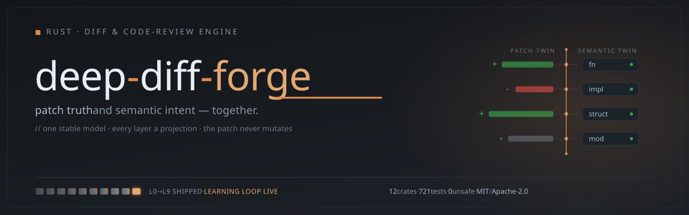
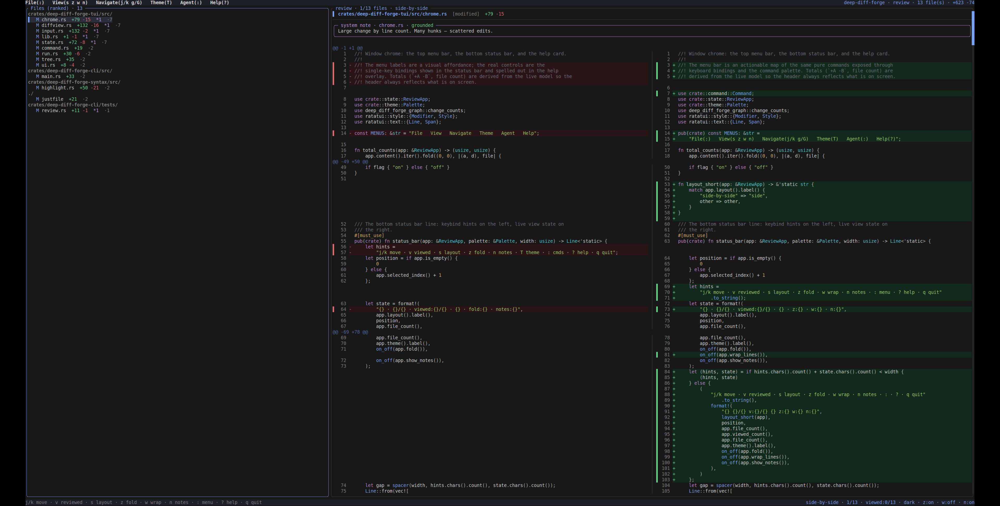

<p align="center">
  
</p>

# Deep-Diff-Forge

**A next-generation review engine for code changes — patch truth and semantic
intent, together.**

Deep-Diff-Forge is a Rust CLI (and optional daemon) that treats a diff not as a
blob of `+`/`-` lines but as a *review*: it preserves the exact, apply-able patch
while layering syntax-aware understanding, syntax highlighting, structural
(AST-level) diffing, risk ranking, agent annotations, an interactive terminal
cockpit, and bounded parallel execution on top — every layer a projection over
one stable model, none of them ever allowed to corrupt the patch.

> **Maturity: L9 (Learning).** All engine layers L0–L8 are implemented, plus the
> L9 local-only learning loop (`learn status|record`). 12 crates, 991 tests, zero
> `unsafe`, supply-chain-gated, dual MIT/Apache-2.0 licensed. The workspace is
> **crates.io-publish-ready** (`cargo publish --dry-run` is clean across all
> crates); the upload itself is **token-gated** — the release workflow publishes
> automatically when `CARGO_REGISTRY_TOKEN` is configured. See
> [`EVIDENCE.md`](EVIDENCE.md) and
> [`CHANGELOG.md`](CHANGELOG.md).

<p align="center">
  
  <br>
  <sub>The review cockpit in side-by-side layout — a risk-ranked file sidebar, a syntax-highlighted two-column diff, and the menu bar. Launch with <code>git diff | deep-diff-forge review</code>.</sub>
</p>

---

## Table of contents

- [Why Deep-Diff-Forge](#why-deep-diff-forge)
- [The first principle](#the-first-principle)
- [Three pioneer features](#three-pioneer-features)
- [Feature comparison](#feature-comparison)
- [Install & build](#install--build)
- [Quick start](#quick-start)
- [Release readiness](#release-readiness)
- [Command reference](#command-reference)
- [Output formats & schemas](#output-formats--schemas)
- [Exit codes](#exit-codes)
- [The optional daemon](#the-optional-daemon)
- [Risk ranking signals](#risk-ranking-signals)
- [Architecture](#architecture)
- [The deployment framework](#the-deployment-framework)
- [Building, testing, and quality gates](#building-testing-and-quality-gates)
- [Project status](#project-status)
- [License](#license)

---

## Why Deep-Diff-Forge

Existing tools each optimize one layer of the review problem:

| Tool | Optimizes | Limit |
| --- | --- | --- |
| classic `diff` | patch truth, exit codes, automation | no semantic or review intelligence |
| `delta`, `diff-so-fancy` | readable terminal rendering | line-oriented; pretty is not understanding |
| `difftastic` | structural (syntax-tree) diffing | output is not apply-able as a patch |
| `hunk` | review-first terminal UI + agent workflow | interactive Node/TS viewer, not a composable machine-readable engine |
| `lumen` | interactive viewer ergonomics | viewer, not an engine |

Deep-Diff-Forge wins by making these layers **cooperate** instead of choosing
one: a conservative, apply-able core with ambitious, clearly-separated
enrichment on top. It is built for humans reviewing AI-generated changes across
many files — and for the agents, scripts, and CI that increasingly drive review.

It is **Bash-first and Claude-Code-first**: every action has a deterministic
command, machine-readable output (`--json` / `--jsonl`), stable exit codes, and
works as a Unix filter with no daemon required. That same deterministic surface
makes it easy to wrap as a **Claude Agent Skill** or a **Pi extension** so an
agent drives the review for you — see [`docs/MAKING_SKILLS.md`](docs/MAKING_SKILLS.md).

## The first principle

> **A diff engine must preserve patch truth while exposing semantic intent.**

Patch truth (the exact text that can be applied) is sacred and *separable* from
every enrichment layer. Semantic analysis, risk ranking, and AI annotations may
be absent, partial, or wrong — they can never mutate the apply-able patch. This
single invariant is enforced everywhere: the parser, the projections, the
ranking, the annotation layer, and the cluster scheduler all read the model;
none rewrite it. Conversely, an internally-incoherent patch is **rejected, not
normalized**: a hunk whose body does not match its declared `@@ -a,b +c,d @@` line
counts, a hunk truncated at EOF or the next file header, or a header missing its
closing `@@` fails to parse (exit 4) rather than being silently repaired into a
plausible-looking model.

## Three pioneer features

1. **Semantic Patch Twin** — every change carries two synchronized
   representations: an apply-able *patch twin* and a syntax *semantic twin*,
   joined by stable anchors. Switch views without losing line anchors, comments,
   or applicability.

2. **Review Intelligence Graph** — a deterministic, explainable risk ranking
   that orders the review stream by likely impact (public-API surface, change
   size, new/deleted/binary, generated-file suppression, test de-prioritization)
   rather than raw file order. (`--rank`)

3. **Adaptive Diff Planner** — per-file/per-region strategy selection with
   explained, budgeted, conservative fallback. (Strategy vocabulary is modeled
   today; semantic strategy selection grows as the Git-input wave feeds file
   bytes.)

---

## Feature comparison

Deep-Diff-Forge is a review **engine**, not a syntax-highlighting pager — so it
brings capabilities the rendering-focused tools don't, and (honestly) doesn't yet
do everything they do. Its closest peer is [`hunk`][hunk], a review-first terminal
viewer; the table reflects default, out-of-the-box behavior.

| Capability | deep-diff-forge | [`hunk`][hunk] | [`delta`][delta] | [`difftastic`][difft] | [`diff-so-fancy`][dsf] | `diff` |
| --- | :---: | :---: | :---: | :---: | :---: | :---: |
| Review-first interactive UI | ✅ | ✅ | ❌ | ❌ | ❌ | ❌ |
| Multi-file review stream + sidebar | ✅ | ✅ | ❌ | ❌ | ❌ | ❌ |
| Inline agent / AI annotations | ✅ | ✅ | ❌ | ❌ | ❌ | ❌ |
| Runtime view toggles (layout / fold / wrap / notes) | ✅ | ✅ | ❌ | ❌ | ❌ | ❌ |
| Mouse support in the viewer | ✅ | ✅ | ❌ | ❌ | ❌ | ❌ |
| Selectable colour themes | ✅ | ✅ | ✅ | ❌ | ❌ | ❌ |
| Deterministic risk ranking | ✅ | ❌ | ❌ | ❌ | ❌ | ❌ |
| Machine-readable JSON / JSONL output | ✅ | ❌ <sup>1</sup> | ❌ | ❌ <sup>2</sup> | ❌ | ❌ |
| Optional shared-cache daemon (UDS) | ✅ | ❌ | ❌ | ❌ | ❌ | ❌ |
| Local, private learning loop | ✅ | ❌ | ❌ | ❌ | ❌ | ❌ |
| Apply-able patch output preserved | ✅ | ❌ <sup>3</sup> | ✅ <sup>4</sup> | ❌ | ✅ <sup>4</sup> | ✅ |
| Syntax highlighting | ✅ <sup>5</sup> | ✅ | ✅ | ✅ | ❌ | ❌ |
| Structural / AST-level diffing | ✅ <sup>6</sup> | ❌ | ❌ | ✅ | ❌ | ❌ |
| Native Git / Jujutsu / Sapling input | ❌ <sup>7</sup> | ✅ | ❌ | ❌ | ❌ | ❌ |
| Watch / auto-reload on change | ❌ | ✅ | ❌ | ❌ | ❌ | ❌ |
| Pager / Unix-filter friendly | ✅ | ✅ <sup>8</sup> | ✅ | ✅ | ✅ | ✅ |

<sup>1</sup> `hunk`'s agent integration is a live in-session skill (`hunk skill
path` / `--agent-context`), not a stable schema'd JSON/JSONL document a script can
consume as a filter.
<sup>2</sup> difftastic has an experimental JSON display; deep-diff-forge ships a
stable, schema-versioned `--json` plus streaming `--jsonl`.
<sup>3</sup> `hunk` is an interactive viewer; it renders patches but does not emit
an apply-able patch to stdout.
<sup>4</sup> `delta` / `diff-so-fancy` re-render an underlying Git diff that
remains apply-able; they do not alter patch truth.
<sup>5</sup> Tree-sitter syntax highlighting (`highlight`), reusing the grammar's
own queries and **terminal-injection-safe** (attacker source can't smuggle
escapes). Rust today; more languages as grammars are added.
<sup>6</sup> Token/leaf-level structural diff (`structural`): **reformat-aware**
(layout-only changes report zero structural change) with best-effort moved-block
detection. difftastic's optimal tree-edit-distance graph diff is deeper.
<sup>7</sup> deep-diff-forge is stdin/pipe-first today (`git diff |
deep-diff-forge`); native `--git` and `<old> <new>` file inputs are on the roadmap.
<sup>8</sup> `hunk` is pager-compatible (a Git/jj/Sapling pager) but is itself an
interactive full-screen UI, not a compose-onward stdout filter.

> The two interactive review tools here are deep-diff-forge and `hunk`, and they
> differ in kind. Deep-Diff-Forge is a composable **Rust engine** — machine-readable
> schemas, an optional UDS daemon, a learning loop, and deterministic risk ranking,
> shipped as a single static binary — optimized for **agent-collaborative,
> scriptable** review of a whole changeset. `hunk` is a feature-rich **Node/TS
> viewer** (OpenTUI) that leads on native VCS integration, watch mode, and
> responsive auto-layout. Comparisons are best-effort against each tool's default
> behavior — corrections welcome via PR.

[hunk]: https://github.com/modem-dev/hunk
[delta]: https://github.com/dandavison/delta
[difft]: https://github.com/Wilfred/difftastic
[dsf]: https://github.com/so-fancy/diff-so-fancy

---

## Install & build

Requires Rust **1.88+** (edition 2024). The build is pinned to a repo-local
target directory.

```bash
git clone https://github.com/Louranicas/deep-diff-forge.git
cd deep-diff-forge

# Build the release binary (repo-local target/)
CARGO_TARGET_DIR=target cargo build --release -p deep-diff-forge-cli

# The binary:
target/release/deep-diff-forge --version
```

If you have [`just`](https://github.com/casey/just):

```bash
just gate-feature      # full quality gate: fmt, check, clippy, pedantic, test, contracts
just contracts         # run the bootstrap contract probes
just status            # repo identity + metadata
```

Optional convenience aliases:

```bash
alias ddf='deep-diff-forge'
git config --global alias.review '!git diff | deep-diff-forge --stdin-patch --rank'
```

## Quick start

```bash
# Human-readable review summary of your working tree
git diff | deep-diff-forge --stdin-patch

# Risk-ranked review: what to look at first
git diff | deep-diff-forge --stdin-patch --rank

# Side-by-side view
git diff | deep-diff-forge --stdin-patch --layout side-by-side

# Machine-readable review document for an agent / CI
git diff | deep-diff-forge --stdin-patch --json

# Symbols of a source file (tree-sitter)
deep-diff-forge semantic src/lib.rs

# Interactive review cockpit
git diff | deep-diff-forge review
```

## Release readiness

For a public release or first-time agent integration, use the same paths the
gates exercise:

```bash
# Build and smoke-check the release binary
cargo build --release --bin deep-diff-forge
target/release/deep-diff-forge --self-test
target/release/deep-diff-forge doctor

# Review a real changeset, or render one headless frame for CI/agents
git diff HEAD~1 HEAD | target/release/deep-diff-forge review
git diff HEAD~1 HEAD | target/release/deep-diff-forge review --probe

# Machine-readable review for agents and automation
git diff HEAD~1 HEAD | target/release/deep-diff-forge --stdin-patch --json
git diff HEAD~1 HEAD | target/release/deep-diff-forge --stdin-patch --rank --json

# Optional daemon lifecycle; run start in one terminal, health/status/stop in another
target/release/deep-diff-forge daemon start --foreground
target/release/deep-diff-forge daemon health
target/release/deep-diff-forge daemon status
target/release/deep-diff-forge daemon stop
```

Before tagging a release, run the repo gate and capture the daemon/security
receipts:

```bash
just gate-release
cargo audit
cargo deny check
python3 scripts/security/daemon_soak.py
```

The daemon and soak test need normal OS runtime/socket permissions; they are
expected to fail in restricted sandboxes that block process/socket operations.
The daemon is optional for correctness: one-shot CLI review, JSON/JSONL output,
and the TUI all work without it.

Recommended release proof for GitHub:

- tag the verified commit, for example `v0.2.1`;
- state that `just gate-release` passed;
- include the TUI test count from the gate output;
- include the daemon soak receipt and `verdict=PASS`;
- call out that crates.io publishing is token-gated by `CARGO_REGISTRY_TOKEN`.

Honest boundary: Deep-Diff-Forge is production-ready as a local, scriptable,
agent-usable diff review and triage engine. Hosted review services, CI bot
publishing flows, and deeper multi-agent orchestration are integration layers on
top of this engine, not requirements for the current release.

---

## Command reference

The primary input today is a unified/Git patch on **stdin** (`--stdin-patch`).
Pipe `git diff`, a `.patch` file, or any unified diff into it.

### `--stdin-patch` — review a patch

```bash
deep-diff-forge --stdin-patch [MODE]
```

| Mode (flag) | Output |
| --- | --- |
| *(none)* | Human review summary: one line per file with `+adds -dels`, hunk count, status. |
| `--json` | One complete `deep-diff-forge.review.v0` JSON document (files, hunks, line anchors, metadata, summary). |
| `--jsonl` | One JSON event per file (`{"event":"diff.file",…}`), newline-delimited — streamed through the real pipeline runner. |
| `--rank` | Risk-ranked review stream (highest-impact first). Add `--json` for `deep-diff-forge.rank.v0`. |
| `--cluster [--parallel serial\|auto\|N]` | Same ranking, computed via bounded parallel lanes with a deterministic join + a receipt. Add `--json` for `deep-diff-forge.cluster.v0`. |
| `--layout inline` | Inline projection with old/new line numbers and markers. |
| `--layout side-by-side` | Two-column old-vs-new projection with a gutter. |
| `--require-files` | Guard (combine with any mode): refuse a patch that parses to **0 files** with exit code 7, an empty stdout, and `refused: 0 files in input (--require-files)` on stderr. Default behaviour (0 files → exit 0) is unchanged without it. |
| `--require-hunks` | Guard (combine with any mode): refuse a patch with **0 hunks or 0 added+removed lines** across all files — a header-only `diff --git a/x b/x`, a rename-only diff, or a context-only hunk — with exit code 7, an empty stdout, and `refused: 0 hunks in input (--require-hunks)` on stderr. `--require-files` alone passes these (one file *is* one file). Default behaviour is unchanged without it. |

A gate or orchestrator should **always pass both** guards, so neither an empty
or mis-piped input nor a hunkless diff can be read as a clean, zero-risk review.
When both are passed and both would fail, the files guard reports first.

Examples:

```bash
git diff HEAD~3 | deep-diff-forge --stdin-patch
git diff | deep-diff-forge --stdin-patch --json   > review.json
git diff | deep-diff-forge --stdin-patch --jsonl  | while read -r ev; do echo "$ev"; done
git diff | deep-diff-forge --stdin-patch --rank --json
git diff | deep-diff-forge --stdin-patch --cluster --parallel 4 --json
# orchestrator / gate: sealed, deterministic, refuses empty or hunkless input
git diff | deep-diff-forge --stdin-patch --rank --json --require-files --require-hunks
```

### `semantic <path>` — tree-sitter symbols

Parse a source file and report its top-level symbols (functions, structs, enums,
traits, impls, modules, consts, …) with line ranges and a parse status.

```bash
deep-diff-forge semantic crates/deep-diff-forge-core/src/lib.rs
deep-diff-forge semantic src/lib.rs --json     # deep-diff-forge.semantic.v0
```

Supported language today: **Rust** (extensible via the tree-sitter registry).
Unsupported extensions degrade with an explicit `fallback:UnsupportedLanguage`,
never a guess. Parsing is byte- and node-budgeted; a malformed file reports
`parsed_with_errors:N` rather than failing.

### `highlight <path>` — syntax highlighting

Print a source file with tree-sitter syntax highlighting, reusing the grammar's
own `highlights.scm` queries.

```bash
deep-diff-forge highlight src/lib.rs               # colour when stdout is a TTY
deep-diff-forge highlight src/lib.rs --color       # force ANSI
deep-diff-forge highlight src/lib.rs --no-color     # plain (still sanitised)
```

Colour is automatic on a terminal and off when piped. Either way the output is
**terminal-injection-safe**: source text is routed through the control-char
sanitiser, so the only raw escapes are fixed SGR colour codes — a hostile file
cannot hijack your terminal.

### `structural <old> <new>` — token-level structural diff

Diff two files by their tree-sitter **token streams** instead of raw lines, so
the result is **reformat-aware**: a change that only reflows whitespace reports
zero structural change.

```bash
deep-diff-forge structural old.rs new.rs            # human summary
deep-diff-forge structural old.rs new.rs --json     # deep-diff-forge.structural.v0
```

Reports added / removed / unchanged tokens, with best-effort moved-block
detection. This is a token/leaf-level diff (not difftastic's optimal
tree-edit-distance), and it never touches patch truth — it only describes source.

### `review [--probe] [--side] [--palette | --cmd NAME]` — interactive review cockpit

```bash
git diff | deep-diff-forge review            # launch the TUI (needs a terminal)
git diff | deep-diff-forge review --side     # start in side-by-side layout
git diff | deep-diff-forge review --probe    # render one frame headlessly (CI/agents, no TTY)
```

The cockpit is a ranked-file tree sidebar plus a diff pane with inline engine /
agent notes, a top menu bar, and a status bar of live view state. Keys (press `?`
in-app for the full card):

| Key | Action |
| --- | --- |
| `j` / `k` · `↓` / `↑` | next / previous file (by rank) |
| `g` / `G` · `Home` / `End` | first / last file |
| `h` / `l` · `←` / `→` | focus the file tree / the diff pane |
| `Enter` | open the selected file / run the selected palette command |
| `s` / `Tab` (also `t`) | toggle inline ↔ side-by-side layout |
| `z` | fold / unfold long runs of unchanged context |
| `w` | wrap / clip long diff rows |
| `n` | show / hide inline agent notes |
| `v` / `Space` | mark the file reviewed (and advance to the next) |
| `T` | cycle colour theme (dark · midnight · mono) |
| `:` | open the command palette |
| `?` | toggle the keybinding help card |
| `Ctrl-d` / `PageDown` · `Ctrl-u` / `PageUp` | scroll the diff down / up |
| `q` · `Esc` | quit · dismiss the current overlay |

**Mouse** is supported too: the scroll wheel scrolls the diff, a click in the
sidebar selects that file, a click in the diff focuses it, and a click on a top
menu name opens it.

**Command palette** — `:` (in-app) runs any engine capability against the loaded
review and shows the result in a panel; the same commands are reachable headlessly
via `--palette` or `--cmd NAME`:

```bash
git diff | deep-diff-forge review --palette          # open the palette, then render
git diff | deep-diff-forge review --cmd rank         # run one command headlessly
git diff | deep-diff-forge review --probe --cols 120 --rows 40   # larger headless frame
```

Command names: `rank`, `outline`, `cluster`, `summary`, `notes`, `review` (the
`review.v0` JSON), `daemon`, `learning`, `maturity`.

`--probe` renders a single frame to stdout via a headless backend (size
configurable with `--cols` / `--rows`) — useful for snapshots, CI, and agents that
cannot attach a terminal.

### `deploy status` — machine-readable deployment state

```bash
deep-diff-forge deploy status            # human
deep-diff-forge deploy status --json     # deep-diff-forge.deployment-status.v0
```

Reports the declared maturity level, the gate stack, and external-observer
posture so CI and orchestration can consume deployment state instead of scraping
prose.

### `deploy release` — release publication posture

```bash
deep-diff-forge deploy release           # human
deep-diff-forge deploy release --json    # deep-diff-forge.release.v0
```

Reports the per-target publication state for the current version — GitHub, GitLab,
the GitHub release, and crates.io. This is a declared snapshot (the actual release
acts are `git tag`, `gh release`, and `cargo publish`); `crates.io` is reported
`blocked` until a registry token is configured, and `pending` lists every
not-yet-published target.

### `daemon` — optional UDS JSON-RPC service

```bash
deep-diff-forge daemon path                      # print the socket path
deep-diff-forge daemon start --foreground        # serve (owner-private UDS)
deep-diff-forge daemon health                     # query a running daemon
deep-diff-forge daemon status
deep-diff-forge daemon stop
# all accept: --socket <PATH>
```

See [The optional daemon](#the-optional-daemon).

### `learn` — local-only learning loop (L9)

Deep-Diff-Forge improves through measured review outcomes. The loop records a
local-only receipt per planner decision (hashes, counts, timings — never a path
or source line), scores each strategy, and gates whether a learned default may
be promoted. Nothing is uploaded; nothing mutates patch truth.

```bash
deep-diff-forge learn status                 # store path, receipt count, scores, trust verdict
deep-diff-forge learn status --json          # deep-diff-forge.learning.v0
echo '<receipt-json>' | deep-diff-forge learn record --stdin   # feed one receipt (agents/CI)
```

Receipts live under `$XDG_STATE_HOME/deep-diff-forge/learning/` (falling back to
`~/.local/state/...`). A fresh machine with no store reports zero receipts and no
trusted default — never an error.

### Diagnostics & contracts

```bash
deep-diff-forge --help
deep-diff-forge --version
deep-diff-forge --self-test            # core model smoke check
deep-diff-forge doctor                 # runtime/cache/state/socket paths
deep-diff-forge claude-code-contract   # agent-facing output guarantees
deep-diff-forge chain-contract         # Unix-filter chaining guarantees
deep-diff-forge cluster-contract       # parallel execution guarantees
deep-diff-forge loom-contract          # assimilation-pipeline guarantees
```

---

## Output formats & schemas

Every machine mode emits a versioned schema string so consumers can rely on
stable fields. `--json` is one complete document; `--jsonl` is one event per
line. Primary output goes to **stdout**; diagnostics to **stderr**.

| Command | Schema |
| --- | --- |
| `--stdin-patch --json` | `deep-diff-forge.review.v0` |
| `--stdin-patch --jsonl` | line events: `{"event":"diff.file",…}` |
| `--stdin-patch --rank --json` | `deep-diff-forge.rank.v0` |
| `--stdin-patch --cluster --json` | `deep-diff-forge.cluster.v0` |
| `semantic --json` | `deep-diff-forge.semantic.v0` |
| `structural --json` | `deep-diff-forge.structural.v0` |
| `deploy status --json` | `deep-diff-forge.deployment-status.v0` |
| `deploy release --json` | `deep-diff-forge.release.v0` |
| `learn status --json` | `deep-diff-forge.learning.v0` |
| `daemon …` | JSON-RPC 2.0 |

### Input sealing (`input_sha256` + `tool`)

Every input-derived document — `review.v0`, `rank.v0`, `cluster.v0`, and
`semantic.v0` — carries two additive top-level members directly after
`schema`, so an orchestrator can treat the document as a **sealed observation**
tied to exact bytes and an exact tool build:

| Member | Meaning |
| --- | --- |
| `input_sha256` | Lowercase hex SHA-256 over the **exact bytes read** (stdin for `--stdin-patch`, the source file for `semantic`), hashed *before* any parsing or normalisation. `sha256sum < input` reproduces it. |
| `tool` | `{"name": "deep-diff-forge", "version": "<CARGO_PKG_VERSION>"}` — the emitting build. |

The schema names stay at `.v0`: the members are purely additive, every
existing field keeps its meaning, and consumers that ignore unknown keys are
unaffected. `--jsonl` events, the human renderers, and documents that are not
derived from an input (`learning.v0`, `deployment-status.v0`, `release.v0`)
carry no seal. Output is deterministic: the same bytes produce byte-identical
stdout and the same `input_sha256` on every run.

Example — `--rank --json`:

```json
{
  "schema": "deep-diff-forge.rank.v0",
  "input_sha256": "9317219840467a00fbb7bc3ff905b0ae26a999582c12c8d02f49d380b398bbb3",
  "tool": {"name": "deep-diff-forge", "version": "0.2.1"},
  "ranked": [
    {"path": "src/lib.rs", "status": "modified", "score": 7, "signals": ["public_api_surface"]},
    {"path": "tests/it.rs", "status": "modified", "score": 1, "signals": ["test_only"]}
  ]
}
```

Example — `--cluster --json` (note the receipt):

```json
{
  "schema": "deep-diff-forge.cluster.v0",
  "input_sha256": "9317219840467a00fbb7bc3ff905b0ae26a999582c12c8d02f49d380b398bbb3",
  "tool": {"name": "deep-diff-forge", "version": "0.2.1"},
  "receipt": {"dimensions": ["patch", "risk"], "parallelism": "fixed:4", "workers": 4, "join_policy": "ranked-review-order", "file_count": 2},
  "ranked": [ /* … */ ]
}
```

JSON strings are RFC-8259 escaped; UTF-8 passes through. File statuses use a
single canonical snake-case spelling (`added`, `modified`, `deleted`,
`renamed`, `type_changed`, `binary_changed`, `unknown`) across every surface.

## Exit codes

| Code | Meaning |
| --- | --- |
| 0 | Success. |
| 2 | CLI usage / argument error. |
| 3 | Input (stdin or file) read failure. |
| 4 | Patch parse failure. |
| 6 | Daemon / interactive-terminal failure. |
| 7 | Input contract refused. `--require-files`: the (well-formed) patch describes 0 files — stderr `refused: 0 files in input (--require-files)`. `--require-hunks`: the patch has 0 hunks or 0 added+removed lines (header-only, rename-only, context-only) — stderr `refused: 0 hunks in input (--require-hunks)`. Gates should pass both. |

Diagnostics never pollute stdout: on error, stdout stays empty and the message
goes to stderr.

## The optional daemon

The daemon accelerates repeated review and multi-client workflows. It is
**never required** for one-shot CLI correctness — every command works without
it. It is **std-first** (no async runtime): a `UnixListener` JSON-RPC 2.0 server
over an owner-private Unix domain socket.

**Security:** the engine-owned runtime directory is created/tightened to `0700`,
must be owned by the effective user, and the socket is `0600`. An explicit `--socket`
path is bound **fail-closed**: an absent parent directory is created `0700`, but a
pre-existing parent is validated and **never re-permissioned** (a group/world-
accessible parent is refused rather than silently tightened to `0700`), and the
socket path is replaced **only if it is already a socket** — the daemon never
deletes a regular file, directory, or symlink it finds there. Review sessions are
bounded by both an **LRU count cap and a 128 MiB aggregate payload cap**. The
server admits at most eight concurrent workers, applies absolute request/response
deadlines, and caps both request and response lines.

**Default socket:** `$XDG_RUNTIME_DIR/deep-diff-forge/deep-diff-forge.sock`. There
is no world-writable `/tmp` fallback: if `$XDG_RUNTIME_DIR` is unset the daemon
fails closed and you pass an explicit `--socket PATH`. (`doctor` reports the
resolved socket, or `<unavailable: set XDG_RUNTIME_DIR or pass --socket>`.)

**JSON-RPC methods:** `engine.initialize`, `daemon.health`, `daemon.status`,
`daemon.shutdown`, `diff.plan`, `session.open`, `session.snapshot`,
`session.close`.

```bash
# Terminal 1
deep-diff-forge daemon start --foreground

# Terminal 2
deep-diff-forge daemon health
# {"id":1,"jsonrpc":"2.0","result":{"status":"ok","pid":…,"protocol":0,"sessions":0,…}}
deep-diff-forge daemon stop
```

## Risk ranking signals

`--rank` / `--cluster` compute a deterministic, explainable score per file.
Higher = review first. Signals:

| Signal | Effect |
| --- | --- |
| `public_api_surface` | `lib.rs` / `mod.rs` / `…/api/…` — strong boost |
| `large_change` | ≥ 80 changed lines |
| `many_hunks` | ≥ 5 hunks |
| `new_file` / `deleted_file` | added / removed file |
| `binary_change` | binary file (no reviewable text) |
| `config_or_lockfile` | `Cargo.toml`, `*.lock`, `*.yaml`, … |
| `test_only` | de-prioritized below equivalent source |
| `generated_or_vendored` | `vendor/`, `node_modules/`, `target/`, `*.min.js`, … — suppressed to 0 |

Ranking is reproducible (a path tie-break makes the order stable) and, under
`--cluster`, **identical for any worker count** — parallelism never changes the
result.

---

## Architecture

Twelve narrow crates with strictly acyclic, inward dependency flow. `core` is
pure vocabulary (no I/O, no parsing); every feature crate depends on `core`,
never the reverse. Patch truth is upstream of everything.

| Crate | Role |
| --- | --- |
| `deep-diff-forge-core` | Stable model: IDs, patch/semantic twins, planner & graph vocabulary, deployment types, `json_escape`. |
| `deep-diff-forge-patch` | Unified/Git patch parser, apply-able renderer, `review.v0` JSON. |
| `deep-diff-forge-projection` | Renderer-neutral inline & side-by-side projections. |
| `deep-diff-forge-pipeline` | Composable Unix-filter stages (`ChainStage`, ingest/render), JSONL. |
| `deep-diff-forge-syntax` | Tree-sitter language detection, budgeted parse, symbol extraction, syntax highlighting, and token-level structural diff. |
| `deep-diff-forge-graph` | Review Intelligence Graph — deterministic risk ranking. |
| `deep-diff-forge-agent` | Annotation provenance, grounding classification, sanitization, anchor validation. |
| `deep-diff-forge-tui` | Review-first terminal UI (ratatui), tested headlessly. |
| `deep-diff-forge-cluster` | Bounded parallel dimensional execution + deterministic joins + receipts. |
| `deep-diff-forge-learning` | L9 local-only learning loop: strategy receipts, scoring, gated promotion. |
| `deep-diff-forge-daemon` | Optional UDS JSON-RPC service (std-first). |
| `deep-diff-forge-cli` | Thin command entry point over the above. |

### Maturity ladder

The codebase advances through declared maturity levels; each is gated and sealed.

```
L0 Bootstrap → L1 Patch → L2 Projection → L3 Pipeline → L4 Semantic
   → L5 Review → L6 Cluster → L7 Daemon → L8 Release → [L9 Learning]
```

**L0–L9 are shipped; `v0.2.0` adds the L9 learning loop and the first
crates.io-publishable cut.** The workspace passes `cargo publish --dry-run`
across every crate; the crates.io upload is token-gated (the release workflow
publishes when `CARGO_REGISTRY_TOKEN` is configured). The learning loop is
local-only and runs without any deployed daemon.

## The deployment framework

Deep-Diff-Forge is developed against an explicit, receipt-backed deployment
framework — the codebase is the source of truth, and docs are binding only until
code implements them, after which code wins or the gate fails.

- **[`docs/DEPLOYMENT_FRAMEWORK.md`](docs/DEPLOYMENT_FRAMEWORK.md)** — the
  governing document: source-of-truth order, deployment modes, the 11-gate
  stack, receipts, maturity ladder, and a bidirectional map to every other doc.
- **[`docs/DEPLOYMENT_GAP_ANALYSIS.md`](docs/DEPLOYMENT_GAP_ANALYSIS.md)** —
  codebase + non-anthropocentric gap passes.
- **[`docs/MODULE_STRUCTURE_PLAN.md`](docs/MODULE_STRUCTURE_PLAN.md)** — the
  crate/module/dependency plan.
- **[`docs/TESTING_GOLD_STANDARD.md`](docs/TESTING_GOLD_STANDARD.md)** — the
  50-meaningful-tests rule and anti-test-fitting discipline.
- **[`docs/AGENTIC_RUST_CODER_V4.md`](docs/AGENTIC_RUST_CODER_V4.md)** — the
  evidence-labelled implementation standard.
- **[`docs/MAKING_SKILLS.md`](docs/MAKING_SKILLS.md)** — build a Claude Agent
  Skill or Pi extension that drives the engine for agent-collaborative review.
- See the framework's documentation map for the full set (architecture, specs,
  API/IPC, chaining/clustering, loom, performance, release, operations, …).

## Building, testing, and quality gates

The mandatory gate (zero tolerance at every stage):

```bash
just gate-feature
# = cargo fmt --check
#   cargo check --workspace
#   cargo clippy --workspace --all-targets -- -D warnings
#   cargo clippy --workspace --all-targets -- -D warnings -W clippy::pedantic
#   cargo test --workspace --locked
#   bootstrap contract probes
```

Standards enforced across the tree: **991 tests** (every production crate ≥ 50
meaningful tests), **zero `unsafe`** (compiler-forbidden workspace-wide via
`[workspace.lints]`), no production `unwrap`/`expect`, pedantic clippy clean with
no unexplained suppressions, and a `cargo-deny` ([`deny.toml`](deny.toml)) +
strict `cargo-audit` supply-chain gate (advisories, licenses, bans, sources) with
every GitHub Action pinned to a commit SHA. CI mirrors the gate in
[`.github/workflows/ci.yml`](.github/workflows/ci.yml) and adds a fuzz-harness
compile gate, a hostile-daemon soak, a learning-privacy probe, and an SPDX SBOM
gate; the release workflow attaches SLSA build-provenance attestations and the
SBOM (`sbom.spdx.json`).

The engine is designed to be run on **untrusted input** (an attacker controls the
whole diff); it has been adversarially hardened against terminal-escape injection,
Trojan-Source / bidi Unicode, memory-exhaustion DoS, and the daemon's
transport/filesystem surface, and a cargo-fuzz harness ([`fuzz/`](fuzz/)) covers
the patch parser, review JSON, daemon protocol, and agent annotations. See
[`SECURITY.md`](SECURITY.md) for the threat model and disclosure policy.

Durable engineering lessons are recorded in [`NOTES.md`](NOTES.md).

## Project status

This is an actively-built engine at **L9 maturity**. Everything documented above
is implemented, gated, and live-proven. Honest current limitations:

- Full **patch↔symbol join** (mapping a hunk to its enclosing semantic symbol in
  a diff) awaits a Git-input layer that supplies file bytes; `semantic <file>`
  proves the engine on whole files today, and `enclosing_symbol` is the ready
  building block.
- The daemon intentionally admits at most eight concurrent local clients; excess
  connections are closed without allocating another worker stack.
- **L9 Learning**: the learning loop records and scores receipts and gates
  promotion; wiring the engine's hot path to *emit* receipts automatically (vs.
  the explicit `learn record`) lands as live signal accrues.
- **Release**: `v0.2.1` is the SOL-1 security-hardening patch release and is
  publish-ready (clean `cargo publish --dry-run` across the workspace); the
  **crates.io** upload is gated on a registry token.
- Time-budget enforcement in the semantic layer is deferred (and never reported
  as a fallback).

## License

Licensed under either of **MIT** or **Apache-2.0** at your option.

---

- **GitHub:** https://github.com/Louranicas/deep-diff-forge
- **Deployment framework:** [`docs/DEPLOYMENT_FRAMEWORK.md`](docs/DEPLOYMENT_FRAMEWORK.md)
