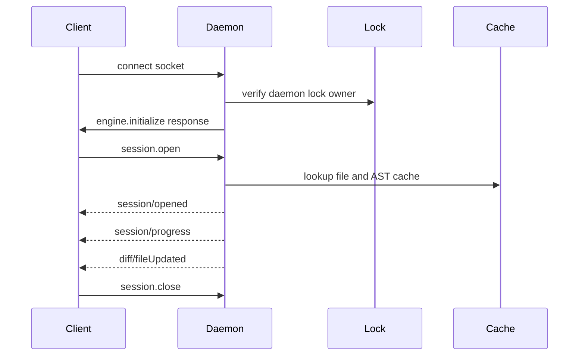

# API And IPC Schematic

This document maps planned API locations, command surfaces, JSON-RPC methods, and Unix domain socket locations.

## Design Rule

The core API is library-first. IPC exists only when a long-lived process provides measurable value: shared cache, multi-client review sessions, or agent coordination.

## Library API Locations

| API area | Planned crate | Primary module | Responsibility |
| --- | --- | --- | --- |
| Core model | `deep-diff-forge-core` | `src/lib.rs` | IDs, patch twin, semantic twin, planner decisions, annotations. |
| Patch parser | `deep-diff-forge-patch` | `src/parser.rs` | Unified patch parsing, metadata preservation. |
| Patch render | `deep-diff-forge-patch` | `src/render.rs` | Apply-able unified patch rendering. |
| Side-by-side rows | `deep-diff-forge-projection` | `src/side_by_side.rs` | Row projection from patch and semantic anchors. |
| Git workspace | `deep-diff-forge-git` | `src/workspace.rs` | Git status, tree, index, worktree state. |
| Git compare | `deep-diff-forge-git` | `src/compare.rs` | File pairs and workspace compare snapshots. |
| Syntax registry | `deep-diff-forge-syntax` | `src/registry.rs` | Language detection and tree-sitter parser selection. |
| Syntax lowering | `deep-diff-forge-syntax` | `src/lower.rs` | Tree-sitter tree to engine syntax tree. |
| Semantic matcher | `deep-diff-forge-syntax` | `src/matcher.rs` | Structural spans, moves, reformats, symbol renames. |
| Planner | `deep-diff-forge-planner` | `src/planner.rs` | Strategy choice and fallback recording. |
| Review graph | `deep-diff-forge-graph` | `src/graph.rs` | File, hunk, symbol, test, owner, risk, agent nodes. |
| Ranking | `deep-diff-forge-graph` | `src/rank.rs` | Deterministic review ordering. |
| Agent API | `deep-diff-forge-agent` | `src/protocol.rs` | Annotation and evidence protocol. |
| Daemon API | `deep-diff-forge-daemon` | `src/rpc.rs` | JSON-RPC transport, sessions, subscriptions. |

## CLI Command Surface

```text
deep-diff-forge <old> <new>
deep-diff-forge --stdin-patch
deep-diff-forge --git
deep-diff-forge --dir <old-dir> <new-dir>
deep-diff-forge review [--git | --stdin-patch | <old> <new>]
deep-diff-forge daemon start
deep-diff-forge daemon stop
deep-diff-forge daemon status
deep-diff-forge cache status
deep-diff-forge cache prune
deep-diff-forge doctor
deep-diff-forge --self-test
deep-diff-forge claude-code-contract
```

## CLI Compatibility Contracts

| Integration | Contract |
| --- | --- |
| `GIT_EXTERNAL_DIFF` | Accept 7-arg and 9-arg Git external diff invocation formats. |
| `git difftool` | Accept explicit old/new file paths and labels. |
| Pager | Stream ANSI output to stdout, no daemon required. |
| CI | Deterministic exit codes and JSON output. |
| Agent tools | JSON and JSONL modes with stable IDs. |
| Claude Code | `claude-code-contract`, stable exit codes, no TTY requirement for machine commands. |
| Bash | stdout for primary output, stderr for diagnostics, no prompts outside interactive commands. |

## JSON-RPC Method Map

The daemon uses JSON-RPC 2.0 over Unix domain sockets on Unix and named pipes on Windows.

| Method | Direction | Purpose |
| --- | --- | --- |
| `engine.initialize` | client -> daemon | Protocol version, client kind, feature negotiation. |
| `session.open` | client -> daemon | Open a review session from Git, patch, file pair, or directory pair. |
| `session.close` | client -> daemon | Release session resources. |
| `session.snapshot` | client -> daemon | Fetch current `ReviewDocument`. |
| `session.subscribe` | client -> daemon | Subscribe to progressive updates. |
| `session.setToggles` | client -> daemon | Update projection toggles without mutating patch truth. |
| `session.setBudgets` | client -> daemon | Adjust byte, node, and time budgets. |
| `diff.plan` | client -> daemon | Return planner decisions without full projection. |
| `diff.compute` | client -> daemon | Compute patch and semantic twins. |
| `projection.render` | client -> daemon | Render inline, side-by-side, stacked, JSON, or compact stream. |
| `annotation.add` | client -> daemon | Add human or agent annotation. |
| `annotation.resolve` | client -> daemon | Mark annotation addressed. |
| `approval.record` | client -> daemon | Record reviewer decision for hunk, file, or agent request. |
| `cache.status` | client -> daemon | Inspect cache hit rate, bytes, entries, and generations. |
| `cache.prune` | client -> daemon | Prune by age, size, repo, or generation. |
| `daemon.shutdown` | client -> daemon | Graceful shutdown. |

## Server Notifications

| Notification | Payload |
| --- | --- |
| `session/opened` | session id, root, input kind. |
| `session/progress` | phase, completed files, total files, active file. |
| `diff/fileUpdated` | file id, patch status, semantic status, fallback reason. |
| `graph/rankUpdated` | ordered file and hunk ids. |
| `annotation/added` | annotation id and anchor. |
| `approval/changed` | target id and decision. |
| `cache/updated` | cache counters and generation id. |
| `error/recoverable` | error code, message, affected target. |

## Unix Domain Socket Locations

Unix sockets are indicated only for the optional daemon.

| Platform | Socket or pipe path |
| --- | --- |
| Linux | `$XDG_RUNTIME_DIR/deep-diff-forge/deep-diff-forge.sock` |
| Linux fallback | `/tmp/deep-diff-forge-$UID/deep-diff-forge.sock` |
| macOS | `$TMPDIR/deep-diff-forge-$UID/deep-diff-forge.sock` |
| Windows | `\\.\pipe\deep-diff-forge-$USER` |

The daemon must create parent directories with mode `0700` on Unix and reject sockets not owned by the current user.

## Socket Lifecycle



## Socket Security Rules

- Bind only to filesystem paths in user-private runtime directories.
- Refuse world-writable parent directories unless sticky-bit semantics and ownership are verified.
- Use per-user daemon ownership.
- Never expose daemon IPC on TCP by default.
- Require explicit `--listen tcp://127.0.0.1:PORT` for development-only TCP.
- Treat agent annotations as untrusted input.
- Cap payload sizes and stream large outputs in chunks.

## Filesystem State Locations

| State | Default location |
| --- | --- |
| Config | `$XDG_CONFIG_HOME/deep-diff-forge/config.toml` or `~/.config/deep-diff-forge/config.toml` |
| Cache | `$XDG_CACHE_HOME/deep-diff-forge/` or `~/.cache/deep-diff-forge/` |
| Runtime socket | `$XDG_RUNTIME_DIR/deep-diff-forge/deep-diff-forge.sock` |
| Session journal | `$XDG_STATE_HOME/deep-diff-forge/sessions/` or `~/.local/state/deep-diff-forge/sessions/` |
| Logs | `$XDG_STATE_HOME/deep-diff-forge/logs/` or `~/.local/state/deep-diff-forge/logs/` |

## Cache Key Schematic

```text
cache-key =
  repo-id +
  file-path +
  object-id-or-content-hash +
  language-id +
  parser-version +
  engine-version +
  planner-budget-profile
```

Cache entries should store:

- decoded text metadata
- line index
- syntax tree summary
- semantic node fingerprints
- generated/vendor classification
- previous fallback reason

## Protocol Versioning

```text
engine.protocol = 0
engine.model = 0
engine.projection = 0
engine.agent_annotations = 0
```

Breaking changes increment the relevant namespace. Clients must feature-negotiate during `engine.initialize`.
