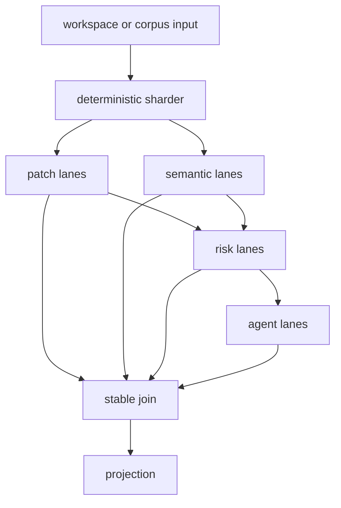

# Chaining And Clustered Execution

Deep-Diff-Forge commands must be useful as Unix filters before they become
interactive applications. Every non-interactive command is designed to compose
with Bash, Claude Code, CI, and other command runners.

## Goals

- Make every machine command pipe-safe.
- Support single-process pipelines without the daemon.
- Support optional clustered execution for large repos and corpora.
- Preserve deterministic output under parallel execution.
- Keep patch truth canonical across every chain stage.

## Command Families

| Family | Planned command | Purpose |
| --- | --- | --- |
| Ingest | `deep-diff-forge ingest` | Convert Git, patch, file-pair, or dir-pair input into review records. |
| Plan | `deep-diff-forge plan` | Emit planner decisions and fallback reasons. |
| Rank | `deep-diff-forge rank` | Order files and hunks by review graph signals. |
| Annotate | `deep-diff-forge annotate` | Attach human or agent annotations with provenance. |
| Render | `deep-diff-forge render` | Project records into human, pager, JSON, JSONL, or compact output. |
| Chain | `deep-diff-forge chain` | Execute a declared local pipeline in one process. |
| Cluster | `deep-diff-forge cluster` | Execute lanes in parallel across files, shards, or corpus batches. |

## Pipe Contracts

```text
stdin   = input records only when --stdin, --stdin-patch, or --from - is set
stdout  = primary output only
stderr  = diagnostics, progress, timings, and warnings
status  = stable exit code
format  = explicit schema version for every JSON or JSONL payload
```

Rules:

- Default human output may use ANSI only when stdout is a TTY.
- `--json` emits one complete JSON document and should not be mixed with
  progress events.
- `--jsonl` emits one event per line and may stream progressively.
- Large outputs must flush by file, hunk, or event boundary.
- Pipe failure must not be hidden as success.
- Stdin is never consumed by accident; a stdin mode must be explicit.

## Chain Examples

```bash
# Machine-readable workspace review.
deep-diff-forge --git --json

# Explicit filter chain.
deep-diff-forge ingest --git --jsonl \
  | deep-diff-forge plan --stdin --jsonl \
  | deep-diff-forge rank --stdin --json \
  | deep-diff-forge render --stdin --plain

# Agent annotation pass with provenance.
deep-diff-forge ingest --git --jsonl \
  | deep-diff-forge annotate --stdin --agent claude-code --jsonl \
  | deep-diff-forge render --stdin --compact

# CI gate that fails if the contract is broken.
set -euo pipefail
deep-diff-forge chain-contract
deep-diff-forge ingest --git --json > review.json
deep-diff-forge plan --stdin --json < review.json > plan.json
```

## Chain Manifest

`deep-diff-forge chain` will accept an explicit manifest when pipelines need to
be reproducible.

```toml
schema = "deep-diff-forge.chain.v0"
name = "claude-fast-review"

[[stage]]
id = "ingest"
command = "ingest"
input = "git"
output = "jsonl"

[[stage]]
id = "plan"
command = "plan"
input = "jsonl"
output = "jsonl"
budget = "fast"

[[stage]]
id = "rank"
command = "rank"
input = "jsonl"
output = "json"
join = "ranked-review-order"
```

## Cluster Model

Cluster execution is a scheduler, not a different engine. It splits work into
lanes, runs lanes in parallel, and rejoins records by stable IDs.



## Cluster Commands

```bash
# Auto parallelism on current machine.
deep-diff-forge cluster --git --dimensions patch,semantic,risk --parallel auto --jsonl

# Bound parallelism for CI runners.
deep-diff-forge cluster --git --parallel 4 --budget balanced --json

# Corpus pass using optional 10TB storage.
deep-diff-forge cluster \
  --corpus /mnt/storage-10tb/deep-diff-forge-corpus/manifest.toml \
  --dimensions patch,semantic,history \
  --parallel auto \
  --receipt ./receipts/corpus-run.json
```

## Determinism Rules

| Rule | Requirement |
| --- | --- |
| Stable IDs | File, hunk, span, annotation, and lane IDs are content-derived or manifest-derived. |
| Stable joins | Default join order is deterministic input order. |
| Explicit ranking | Ranked review order is requested with `--ranked` or through a rank stage. |
| Bounded memory | Lanes stream by file and never require the whole repo in memory. |
| Receipt first | Cluster runs emit a receipt with dimensions, budgets, versions, and skipped lanes. |

## Rust Execution Strategy

The Rust implementation should begin with standard library threads or `rayon`
for CPU-bound file lanes, then introduce `tokio` only for daemon IPC and
multi-client subscriptions. CLI one-shot mode should avoid async complexity
until it has measurable benefit.

Core traits should remain small:

```rust
pub trait ChainStage {
    fn schema(&self) -> &'static str;
    fn run(&self, input: StageInput, sink: &mut dyn StageSink) -> StageResult;
}

pub trait ClusterLane {
    fn dimension(&self) -> ExecutionDimension;
    fn run_lane(&self, shard: ShardRef, sink: &mut dyn StageSink) -> StageResult;
}
```

The first implementation target is local parallelism. Remote distributed
execution is out of scope until local receipts, replay, and failure semantics
are boring and testable.

## Deployment Link

- Framework: [Codebase Deployment Framework](DEPLOYMENT_FRAMEWORK.md)
