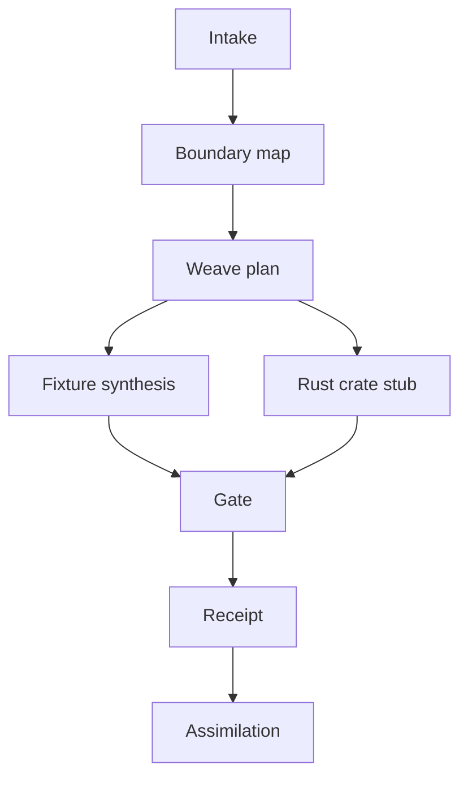

# Deep-Diff-Forge Loom

The Deep-Diff-Forge Loom is a Rust-native assimilation system. Its job is to
turn exemplar repos, design decisions, corpus evidence, and new feature ideas
into controlled implementation work.

The loom is not a hidden code generator. It is an explicit planning and
integration pipeline that produces specs, crate stubs, fixtures, gates, and
receipts before changes land.

## Why A Loom

Deep-Diff-Forge is intentionally combining ideas from review-first tools,
syntax diff engines, pager tools, agent workflows, and corpus learning. Without
a structured assimilation layer, feature work will drift into incompatible
formats and ad hoc decisions.

The loom keeps the system coherent by requiring every new capability to answer:

- What lesson is being adopted?
- What boundary prevents cloning or overreach?
- Which Rust crate owns the behavior?
- Which stable data contracts change?
- Which fixtures prove it works?
- Which gates prove it is deployable?
- Which receipt records the decision?

## Loom Phases



| Phase | Output |
| --- | --- |
| Intake | Source summary, paths, license notes, feature request, corpus references. |
| Boundary map | Adopt, adapt, reject, or defer decisions with reasons. |
| Weave plan | Crate ownership, API deltas, CLI deltas, doc deltas, tests. |
| Fixture synthesis | Minimal patches, semantic examples, expected JSON, expected rendering. |
| Rust crate stub | New module or crate skeleton behind an explicit feature plan. |
| Gate | Formatting, check, tests, fixtures, CLI contract probes. |
| Receipt | JSON receipt containing inputs, decisions, outputs, gates, and risks. |
| Assimilation | Merge-ready branch or patch series with docs and receipts. |

## Planned Commands

```bash
# Explain the loom contract.
deep-diff-forge loom-contract

# Build a loom plan from local exemplars and a feature request.
deep-diff-forge loom plan \
  --source /mnt/storage-10tb/repos/difftastic \
  --source /mnt/storage-10tb/repos/hunk \
  --feature "semantic patch twin moved block detection" \
  --out docs/loom/semantic-move-plan.json

# Generate fixtures from a loom plan.
deep-diff-forge loom fixtures \
  --plan docs/loom/semantic-move-plan.json \
  --out fixtures/semantic-move/

# Verify the integration gates.
deep-diff-forge loom gate --plan docs/loom/semantic-move-plan.json

# Emit a final assimilation receipt.
deep-diff-forge loom receipt --plan docs/loom/semantic-move-plan.json
```

## Assimilation Record

```json
{
  "schema": "deep-diff-forge.loom.v0",
  "feature": "semantic patch twin moved block detection",
  "sources": [
    {
      "path": "/mnt/storage-10tb/repos/difftastic",
      "lesson": "syntax matching with explicit fallback",
      "decision": "adapt"
    }
  ],
  "crate_changes": ["deep-diff-forge-syntax", "deep-diff-forge-planner"],
  "api_changes": ["SemanticChangeKind::MovedNode"],
  "fixtures": ["fixtures/semantic-move/rust-function-move.patch"],
  "gates": ["cargo fmt", "cargo check", "fixture snapshot"],
  "risks": ["parser budget tuning"]
}
```

## Loom Safety Rules

- Never overwrite patch truth.
- Never mutate Git state unless a command is explicitly named for mutation.
- Never delete corpus data.
- Never trust exemplar code without license and boundary notes.
- Never accept ungrounded agent annotations as implementation proof.
- Never merge a loom output without a receipt.
- Never generate `unsafe` Rust unless an explicit unsafe review receipt exists.

## Rust Crate Plan

| Crate | Role |
| --- | --- |
| `deep-diff-forge-loom` | Plan parser, boundary map, receipt schema, fixture manifest. |
| `deep-diff-forge-pipeline` | Chain stage runner used by loom gates. |
| `deep-diff-forge-cluster` | Parallel fixture and corpus execution. |
| `deep-diff-forge-fixtures` | Shared test data and expected outputs. |

Initial implementation should keep `deep-diff-forge-loom` as a library with a
thin CLI wrapper. This allows Claude Code, Bash, CI, and future daemon clients
to run the same loom plan.

## Integration With Dimensional Execution

The loom emits work by dimension.

| Dimension | Loom responsibility |
| --- | --- |
| Patch | Fixture patches and apply-ability checks. |
| Semantic | Syntax fixtures and fallback boundaries. |
| Risk | Ranking fixtures and expected reasons. |
| Agent | Provenance requirements and grounded annotation tests. |
| Runtime | Budget and toggle tests. |
| Storage | Corpus paths, cache policy, receipt retention. |
| History | Prior-art notes and previous outcome links. |
| Presentation | Snapshot expectations for human and machine outputs. |

The loom should be able to run locally, in CI, and over optional 10TB corpus
storage without changing its output schema.

## Deployment Link

- Framework: [Codebase Deployment Framework](DEPLOYMENT_FRAMEWORK.md)
