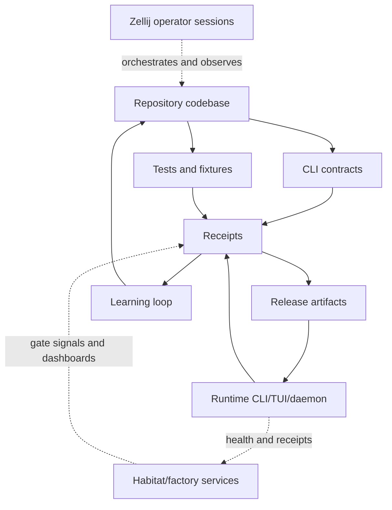
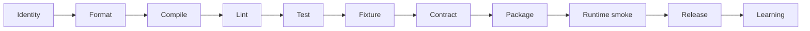
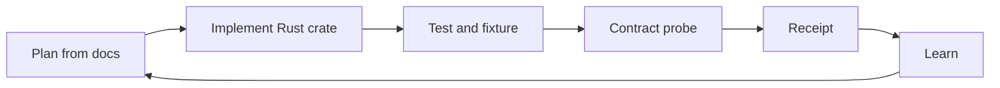
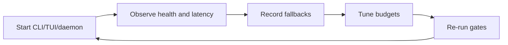
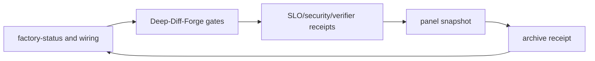
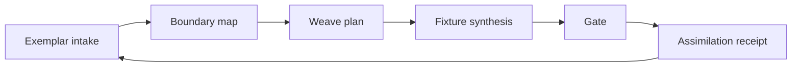

# Codebase Deployment Framework

This framework defines how Deep-Diff-Forge is developed, validated, deployed,
observed, improved, and released. The codebase is the primary source of truth:
Rust crates, CLI behavior, tests, fixtures, receipts, and docs must agree.

The framework is designed for:

- Rust-first implementation.
- CLI/Bash/Claude Code workflows.
- Optional daemon and Unix socket service operation.
- Chainable and clustered command execution.
- Zellij-assisted development sessions.
- Habitat/factory service collaboration without hard runtime coupling.
- Receipt-backed release and learning loops.

## Source Of Truth Order

When signals conflict, resolve in this order:

1. Rust code and tests in `crates/`, `fixtures/`, `benches/`, and `fuzz/`.
2. CLI contract probes and generated receipts.
3. Versioned API schemas and protocol docs.
4. Deployment, operations, and release docs.
5. Exemplar notes and future plans.

Docs are binding when they define a contract that code has not implemented
yet. Once code exists, docs must be updated to match observed behavior or the
gate fails.

## Bidirectional Documentation Map

This document links to every current Markdown source in the repository. Each
document should link back to this framework through a deployment link section.

| Document | Deployment role |
| --- | --- |
| [README](../README.md) | Entry point, product commitment, deployment spine index. |
| [Agentic Rust Coder V4](AGENTIC_RUST_CODER_V4.md) | Evidence-labelled Rust implementation, gates, and reporting standard. |
| [API And IPC](API_AND_IPC.md) | API locations, JSON-RPC, socket locations, protocol versioning. |
| [Architecture](ARCHITECTURE.md) | Layering, crate plan, core principles. |
| [Bash API Contracts](BASH_API_CONTRACTS.md) | Strict shell behavior, JSON/JSONL shapes, exit-code use. |
| [Chaining And Clustering](CHAINING_AND_CLUSTERING.md) | Unix filter chaining and local parallel execution. |
| [Claude Code Bash CLI](CLAUDE_CODE_BASH_CLI.md) | Claude Code and CLI-first contracts. |
| [Deployment Gap Analysis](DEPLOYMENT_GAP_ANALYSIS.md) | Current framework gaps and non-anthropocentric recommendations. |
| [Deep-Diff-Forge Loom](DEEP_DIFF_FORGE_LOOM.md) | Assimilation plans, gates, fixtures, receipts. |
| [Dimensional Execution Model](DIMENSIONAL_EXECUTION_MODEL.md) | Execution dimensions, lane states, join policies. |
| [End To End Deployment](END_TO_END_DEPLOYMENT.md) | Gate sequence from local dev to release and learning. |
| [Evidence](../EVIDENCE.md) | Sealed deployment evidence record (L0 → L1 patch spine). |
| [Feature Baseline](FEATURE_BASELINE.md) | Required baseline capability set. |
| [Feature Deployability Matrix](FEATURE_DEPLOYABILITY_MATRIX.md) | Feature-level gates and deployability criteria. |
| [Hermes Agent Persona](HERMES_AGENT_PERSONA.md) | ARCHON-7 recursive heptadic architecture diagnosis role. |
| [Learning Loop](LEARNING_LOOP.md) | Post-run feedback and promotion rules. |
| [Module Structure Plan](MODULE_STRUCTURE_PLAN.md) | Rust workspace, crate, module, dependency, and code-flow plan. |
| [Operations And Daemon](OPERATIONS_AND_DAEMON.md) | Optional daemon, health, UDS, service behavior. |
| [Performance And Novelty](PERFORMANCE_AND_NOVELTY.md) | Performance posture and top-tail feature choices. |
| [Pioneer Feature Specs](PIONEER_FEATURE_SPECS.md) | Semantic twin, review graph, adaptive planner specs. |
| [Problem-Solver God-Tier Setup](PROBLEM_SOLVER_GOD_TIER_SETUP.md) | High-cost design decision role, verdict shape, and V4 handoff. |
| [Release And Publication](RELEASE_AND_PUBLICATION.md) | Versioning, artifact publication, mirror policy. |
| [Roadmap](ROADMAP.md) | Implementation phase order. |
| [Rust Implementation Strategy](RUST_IMPLEMENTATION_STRATEGY.md) | Rust crate strategy, dependencies, errors, tests. |
| [Schematics](SCHEMATICS.md) | Diagrams and system topology. |
| [Storage And 10TB Corpus](STORAGE_AND_10TB_CORPUS.md) | Optional large corpus and archive policy. |
| [Testing Gold Standard](TESTING_GOLD_STANDARD.md) | Minimum meaningful tests, integration coverage, and anti-test-fitting rules. |
| [Vision](VISION.md) | Product direction and non-negotiables. |

## Deployment Architecture



## Deployment Modes

| Mode | Authority | Mutation | Required gates | Output |
| --- | --- | --- | --- | --- |
| Observe | Read-only | None | identity, status | status receipt |
| Docs | Repo docs only | Markdown/specs | fmt/check if code touched | docs receipt |
| Dev gate | Repo-local | Tests/build artifacts | fmt, check, tests | gate receipt |
| Feature integration | Repo-local | Rust crates and fixtures | full local gate | integration receipt |
| Daemon smoke | Runtime state | XDG runtime/cache only | IPC smoke, health | daemon receipt |
| Release candidate | Dist output | release assets | full gate, package, smoke | release receipt |
| Production release | Public remotes | tag/assets/crates | no-mistakes gate, final ack | publication receipt |

The codebase is at L5 (review spine): patch parser, projection, pipeline,
semantic layer, the Review Intelligence Graph (`--rank`), the agent annotation
layer, and the review TUI (`review`, ratatui) all exist, governed by a
`deny.toml` supply-chain policy. Release deployment remains blocked until the
cluster/daemon layers and outward publication (credential-gated) land.

Current gaps and recommendations are tracked in
[Deployment Gap Analysis](DEPLOYMENT_GAP_ANALYSIS.md).

## Gate Stack



## Justfile Command Surface

The repository includes a `justfile` that turns the deployment framework into
repeatable local commands. The Justfile is a thin runner over Rust and shell
contracts; it does not replace the CLI as the product interface.

Assimilated patterns:

- Rust service justfiles: `fmt`, `check`, `clippy`, `test`, and gate recipes.
- Factory/habitat justfiles: read-only observation and receipt-first gates.
- Small crate justfiles: repo-local `CARGO_TARGET_DIR=target`.

| Recipe | Deployment role |
| --- | --- |
| `just status` | Gate 0 identity and metadata check. |
| `just fmt` | Gate 1 formatting. |
| `just check` | Gate 2 compile. |
| `just clippy` | Gate 3 lint. |
| `just pedantic` | V4 pedantic clippy gate. |
| `just test` | Gate 4 tests. |
| `just test-audit` | Informational count against the 50-test production standard. |
| `just contracts` | Gate 6 bootstrap contract probes. |
| `just gate-docs` | Docs-only gate for planning changes. |
| `just gate-bootstrap` | Current L0 deployment gate. |
| `just gate-feature` | Stricter feature gate for Rust implementation changes. |
| `just ci` | Local CI equivalent. |
| `just zellij-observe` | Optional Zellij session observation. |
| `just habitat-observe` | Optional habitat/factory status and wiring observation. |
| `just doctor` | Combined status, contracts, and optional external observation. |
| `just receipt-bootstrap` | Writes a bootstrap deployment receipt under `reports/`. |

Generated receipts are intentionally ignored by Git through `/reports/`.

## Agentic Rust Coder V4 Gate

[Agentic Rust Coder V4](AGENTIC_RUST_CODER_V4.md) is the implementation
standard for Rust changes. Its core rule is that every substantive codebase
claim must be warranted as `[VBR]`, `[VBE]`, `[IFP]`, or `[CONJ]`.

The required loop is:

```text
read relevant code -> make smallest change -> run gate -> read output -> decide
```

The executable V4 gate is:

```bash
just gate-feature
```

That recipe runs formatting, compile, standard clippy, pedantic clippy, tests,
and bootstrap contract probes with repo-local `CARGO_TARGET_DIR=target`.

V4 deployment rules:

- Read `NOTES.md` at session start and update it only with durable lessons.
- No production `unwrap` or `expect`.
- No unexplained clippy suppressions.
- No compiler appeasement through reflexive `clone`, broad `Arc<Mutex<_>>`,
  `'static`, or bounds that do not model the data flow.
- No performance claim without benchmark evidence.
- No unsafe soundness claim without Miri where unsafe code exists.
- No completion claim without command output or file-line evidence.

## Hermes And Problem-Solver Setup

[Hermes Agent Persona](HERMES_AGENT_PERSONA.md) and
[Problem-Solver God-Tier Setup](PROBLEM_SOLVER_GOD_TIER_SETUP.md) are design
roles, not deployment actuators. They apply before high-cost architecture
choices such as public API shape, ownership-model redesign, daemon protocols,
cache invalidation, schema versioning, release policy, and dependency strategy.

Hermes supplies the recursive heptadic loop:

```text
decompose -> abstract -> invert -> constrain -> transfer -> trace -> reframe
```

The problem-solver setup supplies the seven-part verdict:

```text
diagnosis -> constraint map -> architecture -> failure profile
  -> trade-off position -> confidence -> implementation sequence
```

The handoff contract is:

```text
Hermes/problem-solver verdict -> V4 implementation loop -> deployment receipts
```

### Gate 0: Identity

Purpose: ensure commands are operating on the intended repo and branch.

```bash
test "$(basename "$PWD")" = "deep-diff-forge"
git status --short --branch
git remote -v
CARGO_TARGET_DIR=target cargo metadata --no-deps >/dev/null
```

Acceptance:

- Repo basename is `deep-diff-forge`.
- Dirty files are intentional.
- GitHub remote is configured.
- GitLab remote is optional until project/credentials exist.
- Build target is repo-local `target/`.

### Gate 1: Format

```bash
cargo fmt --all --check
```

Acceptance:

- Rust formatting passes.
- Markdown changes avoid accidental non-ASCII unless intentionally required.

### Gate 2: Compile

```bash
CARGO_TARGET_DIR=target cargo check --workspace
```

Acceptance:

- Workspace compiles.
- Bootstrap CLI contract commands remain available.
- No code path requires daemon startup for basic CLI operation.

### Gate 3: Lint

```bash
CARGO_TARGET_DIR=target cargo clippy --workspace --all-targets -- -D warnings
```

Acceptance:

- Warnings fail the gate.
- Future pedantic rules are introduced crate by crate after public APIs settle.

### Gate 4: Test

```bash
CARGO_TARGET_DIR=target cargo test --workspace --locked
```

Acceptance:

- Unit tests pass.
- Integration tests pass.
- Contract tests verify stdout, stderr, and exit codes.
- Every production module or crate has at least 50 meaningful tests before it
  is release-eligible.
- Test suites include integration tests for public command, API, filesystem,
  socket, pipeline, or process boundaries when those boundaries exist.
- Tests follow [Testing Gold Standard](TESTING_GOLD_STANDARD.md), including
  the explicit ban on test fitting.

### Gate 5: Fixture

Fixture groups:

- `fixtures/patch`
- `fixtures/syntax`
- `fixtures/projection`
- `fixtures/graph`
- `fixtures/agent`
- `fixtures/loom`

Acceptance:

- Patch fixtures round-trip.
- Projection snapshots are deterministic.
- Semantic fallback fixtures preserve patch truth.
- Agent annotations remain clearly grounded or ungrounded.

### Gate 6: Contract

Bootstrap contract probes:

```bash
CARGO_TARGET_DIR=target cargo run -p deep-diff-forge-cli -- --self-test
CARGO_TARGET_DIR=target cargo run -p deep-diff-forge-cli -- doctor
CARGO_TARGET_DIR=target cargo run -p deep-diff-forge-cli -- claude-code-contract
CARGO_TARGET_DIR=target cargo run -p deep-diff-forge-cli -- chain-contract
CARGO_TARGET_DIR=target cargo run -p deep-diff-forge-cli -- cluster-contract
CARGO_TARGET_DIR=target cargo run -p deep-diff-forge-cli -- loom-contract
```

Future contract probes:

```bash
deep-diff-forge --stdin-patch --json < fixtures/patch/basic.patch
deep-diff-forge ingest --git --jsonl
deep-diff-forge chain --manifest .deep-diff-forge/chain.toml
deep-diff-forge cluster --git --dimensions patch,semantic,risk --parallel auto --json
deep-diff-forge loom gate --plan docs/loom/current.json
```

Acceptance:

- Machine commands do not require TTY.
- JSON is a complete document.
- JSONL is one event per line.
- Primary output goes to stdout.
- Diagnostics go to stderr.
- Exit codes match documented meanings.

### Gate 7: Package

```bash
cargo package --workspace --allow-dirty
CARGO_TARGET_DIR=target cargo build -p deep-diff-forge-cli --release --locked
```

Acceptance:

- Package metadata is complete.
- Binary starts and reports version.
- Artifact paths match the release plan.

### Gate 8: Runtime Smoke

CLI:

```bash
target/release/deep-diff-forge --help
target/release/deep-diff-forge --version
target/release/deep-diff-forge --self-test
```

Daemon, when included:

```bash
target/release/deep-diff-forge daemon start --foreground
target/release/deep-diff-forge daemon health --json
target/release/deep-diff-forge daemon stop
```

Acceptance:

- CLI runs without daemon.
- Daemon binds only user-private UDS/named-pipe locations.
- Health returns protocol versions, pid, session count, and cache status.

### Gate 9: Release

Release order:

1. Create release branch or clean main commit.
2. Generate release receipt.
3. Tag `vX.Y.Z`.
4. Push GitHub.
5. Push GitLab when remote is available.
6. Upload assets.
7. Publish crates only after binary smoke passes.

### Gate 10: Learning

Learning inputs:

- deployment receipts
- fixture drift
- benchmark deltas
- daemon health trends
- cluster lane fallbacks
- review graph ranking outcomes
- agent annotation grounding outcomes

Learning output:

- planner defaults
- ranking weights
- fallback budgets
- cache policy
- documentation corrections

No learned behavior may mutate patch truth.

## Receipt Schema

Every deployment run should write a receipt directory.

```text
reports/deployments/YYYYMMDDTHHMMSSZ/
  manifest.toml
  git.txt
  docs.txt
  fmt.txt
  check.txt
  clippy.txt
  test.txt
  fixtures.txt
  contracts.txt
  package.txt
  runtime.txt
  habitat.txt
  zellij.txt
  summary.json
```

`summary.json`:

```json
{
  "schema": "deep-diff-forge.deployment-receipt.v0",
  "repo": "deep-diff-forge",
  "commit": "unknown",
  "mode": "dev-gate",
  "started_at": "2026-06-21T00:00:00Z",
  "finished_at": "2026-06-21T00:00:01Z",
  "gates": {
    "identity": "pass",
    "fmt": "pass",
    "check": "pass",
    "test": "not-run",
    "contracts": "pass"
  },
  "habitat": {
    "observed": true,
    "required_for_pass": false
  }
}
```

## Zellij Collaboration Framework

Zellij is an operator and collaboration surface, not a required engine
dependency.

Use Zellij for:

- long-running development sessions
- split panes for code, tests, logs, and docs
- parallel observation of build, contract, daemon, and habitat status
- handoff notes between agents or operators

Do not use Zellij for:

- hidden deployment state
- unrecorded gate bypasses
- implicit daemon startup
- destructive actions without explicit commands

Recommended panes:

| Pane | Command | Purpose |
| --- | --- | --- |
| code | editor or agent | code and docs changes |
| gate | `cargo fmt`, `cargo check`, `cargo test` | Rust validation |
| contract | `deep-diff-forge *-contract` | CLI contract checks |
| daemon | `deep-diff-forge daemon start --foreground` | future daemon smoke |
| habitat | `factory-status`, `factory-wiring` | external service posture |
| receipts | receipt tail or summary | deployment evidence |

Zellij session health can be recorded in `zellij.txt`, but gate truth comes
from command receipts and Rust test results.

## Habitat And Factory Service Collaboration

Deep-Diff-Forge should collaborate with habitat/factory services through
observable contracts:

- CLI status output.
- JSON health output.
- UDS daemon health.
- deployment receipts.
- SLO receipts.
- security receipts.
- panel snapshots.

It should not require habitat services to run local CLI, tests, or one-shot
review flows.

### Current Habitat Observations

The local habitat/factory surface provides useful patterns:

- service registry with health endpoints and required modes
- policy envelope with read-only, gate-only, dev deploy, and production deploy
  authority
- receipt-backed refusal as a valid safe outcome
- protected repository handling
- wiring/status probes
- SLO, security, risk, verifier, and world-model receipts

Deep-Diff-Forge adopts the pattern, not the dependency.

### Service Row

Future service registry entry:

| Field | Value |
| --- | --- |
| id | `deep_diff_forge` |
| name | `Deep-Diff-Forge` |
| transport | Unix domain socket |
| path | `$XDG_RUNTIME_DIR/deep-diff-forge/deep-diff-forge.sock` |
| health | `daemon.health` |
| required modes | `gate_only`, `deploy_dev`, `production` when daemon is enabled |
| protected | false |
| canonical count | true after daemon release |

### Factory Mode Mapping

| Factory mode | Deep-Diff-Forge action |
| --- | --- |
| `research` | Read docs, run contract probes, write analysis receipt. |
| `gate_only` | Run local gates and write deployment receipt. |
| `deploy_dev` | Build release binary, run daemon smoke, publish dev receipt. |
| `production` | Require final human acknowledgement, no-mistakes gate, release receipt. |

### Habitat Safety Rules

- Factory services may observe and gate; the Rust CLI owns engine behavior.
- Habitat may not rewrite patch truth.
- Habitat may not publish releases without release receipts.
- Habitat may not deploy daemon mode unless socket security passes.
- Protected dirty repos outside this repo are warnings, not automatic blockers
  for docs-only Deep-Diff-Forge work.

## No-Mistakes Deployment Loop

Use this loop before publishing or merging higher-risk code:

```text
scope -> implement -> format -> check -> lint -> test -> fixture -> contract
  -> review diff -> receipt -> push -> CI -> release gate
```

Rules:

- Findings lead; summaries follow.
- Tests scale with blast radius.
- Dirty unrelated files are ignored, not reverted.
- A green deployment requires receipts, not just local confidence.
- Network publication is separate from local validation.

## Synergy Loops

### Code Loop



### Runtime Loop



### Habitat Loop



### Loom Loop



## Deployment File Ownership

| Path | Owner | Role |
| --- | --- | --- |
| `crates/` | Rust implementation | source of behavior |
| `fixtures/` | test and regression owners | small reproducible evidence |
| `benches/` | performance owners | latency and memory evidence |
| `fuzz/` | parser/codec owners | resilience evidence |
| `docs/` | architecture owners | source-of-truth contracts until code lands |
| `reports/` | deployment runner | receipts and publication evidence |
| `/mnt/storage-10tb/deep-diff-forge-*` | corpus runner | optional large corpus artifacts |
| `$XDG_RUNTIME_DIR/deep-diff-forge/` | daemon | socket and runtime locks |
| `$XDG_CACHE_HOME/deep-diff-forge/` | daemon/cache | content-addressed cache |
| `$XDG_STATE_HOME/deep-diff-forge/` | runtime | sessions, logs, learning receipts |

## Environment Variables

| Variable | Purpose |
| --- | --- |
| `CARGO_TARGET_DIR=target` | Keep build output repo-local. |
| `DDF_CONFIG` | Future explicit config file override. |
| `DDF_CACHE_DIR` | Future cache override. |
| `DDF_STATE_DIR` | Future state override. |
| `DDF_SOCKET` | Future daemon socket override. |
| `DDF_RECEIPT_DIR` | Deployment receipt output directory. |
| `DDF_CORPUS_DIR` | Optional large corpus root. |
| `NO_COLOR` | Disable ANSI color for shell/CI compatibility. |

No environment variable may be required for correctness when a command-line
flag can express the same requirement.

## Deployment Command Recipes

### Docs-Only Gate

```bash
just gate-docs
```

### Bootstrap CLI Gate

```bash
just gate-bootstrap
```

### Feature Gate

```bash
just gate-feature
```

### Habitat Observation Gate

```bash
just habitat-observe
just zellij-observe
```

These commands inform the deployment receipt. They do not replace Rust gates.

## Blocking Rules

Block deployment when:

- Rust compile fails.
- Contract probes fail.
- Patch truth cannot be produced for a supported patch input.
- Daemon socket security fails.
- Release receipt cannot be written.
- Production release lacks final acknowledgement.
- Publication target credentials are missing for the requested target.

Warn but do not block docs-only work when:

- GitLab mirror is unavailable.
- Optional habitat services are degraded.
- Zellij session naming or layout differs.
- 10TB corpus path is unavailable.
- Unrelated protected repos are dirty.

## Rollback Framework

| Surface | Rollback |
| --- | --- |
| Docs | revert or amend doc commit. |
| CLI binary | restore previous binary artifact. |
| Crates | publish patch release or yank only if dangerous. |
| Daemon | stop service, remove owned socket, restore previous binary. |
| Cache | ignore incompatible versioned entries. |
| Release | mark release superseded and publish corrective receipt. |

Rollback receipts must include:

- prior version
- target version
- reason
- commands run
- verification result
- remaining risks

## Deployment Maturity Levels

| Level | Name | Criteria |
| --- | --- | --- |
| L0 | Bootstrap | Docs, core vocabulary, CLI smoke commands. |
| L1 | Patch | Patch parser, renderer, JSON output, fixtures. |
| L2 | Projection | Inline/side-by-side/stacked/pager output. |
| L3 | Pipeline | Chain stages and strict Bash contracts. |
| L4 | Semantic | Tree-sitter syntax and semantic fallback. |
| L5 | Review | TUI, graph ranking, agent annotations. |
| L6 | Cluster | Parallel dimensional lanes and corpus receipts. |
| L7 | Daemon | UDS daemon, shared cache, health, subscriptions. |
| L8 | Release | Signed assets, crates, CI, no-mistakes gate. |
| L9 | Learning | Corpus-driven promotion and SLO-backed defaults. |

The current repository is L5 (patch + projection + pipeline + semantic + review
spines shipped: `deep-diff-forge-{patch,projection,pipeline,syntax,graph,agent,tui}`,
`--stdin-patch [--json | --jsonl | --rank | --layout …]`, `semantic <path>`,
`review [--probe]`, `deploy status`, patch fixtures, `deny.toml` policy) with
planned L6 Cluster next.

## Framework Maintenance

Update this document when:

- a new crate is added
- a new command contract is introduced
- socket locations change
- CI gates change
- habitat integration changes
- release channels change
- a new Markdown document is added

Every new Markdown document should be added to the bidirectional documentation
map and should include a link back to this deployment framework.
