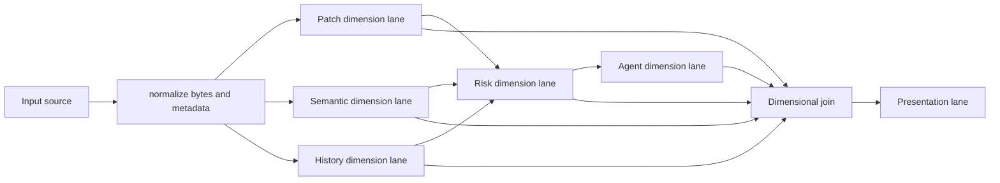

# Dimensional Execution Model

Deep-Diff-Forge treats a diff as a set of synchronized dimensions. A dimension
is an independently computable view of the same change, joined through stable
anchors. This gives the engine parallelism without sacrificing review trust.

## Dimensions

| Dimension | Purpose | Primary output |
| --- | --- | --- |
| Patch | Canonical apply-able change. | `PatchTwin`, hunks, line anchors. |
| Semantic | Syntax and intent. | `SemanticTwin`, syntax spans, moves, reformats. |
| Risk | Review priority and impact. | Risk scores, reasons, graph edges. |
| Agent | Human and AI annotations. | Grounded notes, evidence links, approvals. |
| Runtime | Toggles, budgets, and session state. | Planner controls and projection controls. |
| Storage | Cache and corpus metadata. | Cache keys, receipts, retention state. |
| History | Git ancestry and prior review memory. | Similarity, churn, previous outcomes. |
| Presentation | User-facing projections. | Inline, side-by-side, stacked, JSON, compact. |

## Anchor Map

Every dimension joins through stable anchors.

```text
file-id
  hunk-id
    patch-line-id
    semantic-span-id
    risk-signal-id
    annotation-id
    projection-row-id
```

The patch dimension is authoritative for apply-ability. Other dimensions can
be absent, partial, or delayed.

## Execution Lanes



## Lane States

| State | Meaning |
| --- | --- |
| `pending` | The lane has not started. |
| `running` | Work is active. |
| `ready` | Output is available. |
| `partial` | Output is available with fallback records. |
| `skipped` | Lane was disabled by budget, input kind, or command flags. |
| `failed-recoverable` | Patch truth remains available and the failure is recorded. |
| `failed-hard` | The command cannot produce a valid requested output. |

## Planner Budget Profiles

| Profile | Patch | Semantic | Risk | Agent |
| --- | --- | --- | --- | --- |
| `fast` | required | small files only | deterministic cheap signals | disabled unless requested |
| `balanced` | required | budgeted supported languages | graph rank | grounded notes only |
| `deep` | required | expanded syntax and move search | history and ownership | full evidence pass |
| `corpus` | required | benchmark profile | aggregate signals | disabled by default |

## Join Policies

| Policy | Use case |
| --- | --- |
| `deterministic-input-order` | Default JSON, JSONL, and CI output. |
| `ranked-review-order` | Human review stream and agent triage. |
| `as-ready-with-stable-ids` | Progress UI, daemon subscriptions, corpus runs. |

## Dimensional Receipts

Every clustered or deep run should emit a receipt.

```json
{
  "schema": "deep-diff-forge.dimension-receipt.v0",
  "engine_version": "0.1.0",
  "input": "git",
  "dimensions": ["patch", "semantic", "risk"],
  "join_policy": "deterministic-input-order",
  "parallelism": "auto",
  "fallbacks": [],
  "started_at": "2026-06-21T00:00:00Z",
  "finished_at": "2026-06-21T00:00:01Z"
}
```

## Rust Boundary

The dimensional model belongs in `deep-diff-forge-core`. Execution belongs in
separate crates so the model stays stable:

| Crate | Responsibility |
| --- | --- |
| `deep-diff-forge-core` | Dimension enums, lane descriptors, stable IDs, receipts. |
| `deep-diff-forge-pipeline` | Chain stages, stream codecs, local stage runner. |
| `deep-diff-forge-cluster` | Sharding, parallel lane scheduling, join policies. |
| `deep-diff-forge-daemon` | Optional long-lived lane cache and subscriptions. |

`unsafe` is not required for the initial model or runner. Any future unsafe
optimization must be isolated, benchmarked, fuzzed, and feature-gated.

