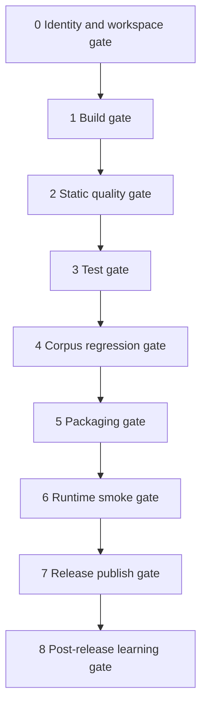

# End To End Deployment Specification

This document defines the deployment spine for Deep-Diff-Forge from local development through public release, daemon rollout, and post-release learning.

## Deployment Philosophy

Deep-Diff-Forge deploys through gates, not hope.

The deployment model borrows three corpus patterns:

- From the 10TB migration runbook: identity gates, reversible phases, verification sentinels, and explicit destructive boundaries.
- From the Habitat service roster: clear service identity, health endpoints, dependency batches, and UDS-first service citizens where TCP is unnecessary.
- From no-mistakes: isolated validation before upstream publication, clean PRs, and no-green-without-receipt.

## Release Targets

| Target | Artifact | First-class? | Notes |
| --- | --- | --- | --- |
| CLI | `deep-diff-forge` binary | Yes | Pager-compatible and CI-compatible. |
| Library | Rust crates | Yes | Core model and optional engine crates. |
| TUI | `deep-diff-forge review` | Yes | Interactive terminal review. |
| Daemon | `deep-diff-forge daemon` | Yes, opt-in | UDS-first shared cache and session service. |
| Desktop/IDE adapters | Adapter crates | Later | Renderer-neutral projection layer feeds them. |
| Containers | OCI image | Later | Useful for CI review services, not required locally. |

## Environment Matrix

| Environment | Purpose | Transport | Persistence | Gate level |
| --- | --- | --- | --- | --- |
| Local dev | Fast iteration | In-process or CLI | Repo-local `target/` | Check + tests |
| Local review | Real user workflow | CLI/TUI | XDG cache/state | Check + TUI smoke |
| Daemon dev | IPC and cache validation | UDS | XDG runtime/cache/state | Check + IPC smoke |
| CI | Repeatable validation | CLI only | Ephemeral | Full gate |
| Release | Signed artifacts | CLI/daemon | Packaged defaults | Full gate + receipts |
| Habitat deployment | Long-running service citizen | UDS only by default | XDG state/cache | Full gate + health |

## Phase Gates



### Gate 0: Identity And Workspace

Checks:

- Current repo basename is `deep-diff-forge`.
- Git branch is intentional.
- Working tree is clean or all dirty files are explicitly included.
- Remotes are known: GitHub and, when credentials exist, GitLab.
- Build output stays in repo-local `target/`, never an accidental read-only global target directory.

Command skeleton:

```bash
git status --short --branch
git remote -v
CARGO_TARGET_DIR=target cargo metadata --no-deps >/dev/null
```

### Gate 1: Build

```bash
CARGO_TARGET_DIR=target cargo check --workspace
```

Future expansion:

```bash
CARGO_TARGET_DIR=target cargo build --workspace --locked
CARGO_TARGET_DIR=target cargo build --workspace --release --locked
```

### Gate 2: Static Quality

```bash
cargo fmt --all --check
CARGO_TARGET_DIR=target cargo clippy --workspace --all-targets -- -D warnings
```

Pedantic mode becomes mandatory once public API docs stabilize:

```bash
CARGO_TARGET_DIR=target cargo clippy --workspace --all-targets -- -D warnings -W clippy::pedantic
```

### Gate 3: Tests

```bash
CARGO_TARGET_DIR=target cargo test --workspace --locked
```

Expected test classes:

- patch parser fixtures
- semantic fallback fixtures
- projection snapshots
- daemon socket lifecycle tests
- cache key stability tests
- agent annotation grounding tests

### Gate 4: Corpus Regression

The corpus gate uses fixtures inspired by Difftastic's sample-file regression model.

Required fixture classes:

- exact line edits
- word-only edits
- reformat-only edits
- moved function
- renamed symbol
- malformed syntax
- unsupported language
- large file fallback
- generated file suppression
- binary diff
- rename and mode changes
- no-newline metadata
- grounded agent annotation
- ungrounded agent annotation

Output snapshots:

```text
fixtures/expected/inline/
fixtures/expected/side-by-side/
fixtures/expected/json/
fixtures/expected/review-graph/
```

### Gate 5: Packaging

First release forms:

```bash
cargo package --workspace --allow-dirty
CARGO_TARGET_DIR=target cargo build -p deep-diff-forge-cli --release --locked
```

Later release forms:

- GitHub Release assets
- GitLab Release assets
- crates.io publish
- cargo-binstall metadata
- Linux tarball
- macOS tarball
- Windows zip
- optional DEB/RPM after daemon/systemd assets exist

### Gate 6: Runtime Smoke

CLI:

```bash
target/release/deep-diff-forge --version
target/release/deep-diff-forge --help
target/release/deep-diff-forge --self-test
```

Daemon:

```bash
deep-diff-forge daemon start --foreground --socket "$XDG_RUNTIME_DIR/deep-diff-forge/deep-diff-forge.sock"
deep-diff-forge daemon status
deep-diff-forge daemon stop
```

The daemon smoke must assert:

- socket parent mode is `0700`
- socket mode is `0600` where supported
- owner is current UID
- stale sockets are detected and handled
- JSON-RPC `engine.initialize` and `daemon.health` pass

### Gate 7: Publish

Publishing order:

1. Commit release changes.
2. Tag `vX.Y.Z`.
3. Push to GitHub.
4. Push to GitLab when credentials/project exist.
5. Create release assets.
6. Publish crates only after release artifacts pass smoke.

GitHub:

```bash
git push github main
git push github vX.Y.Z
```

GitLab:

```bash
git push gitlab main
git push gitlab vX.Y.Z
```

### Gate 8: Post-Release Learning

After release, record:

- compile time
- binary size
- benchmark deltas
- parse fallback rate
- cache hit rate
- crash or panic reports
- review graph ranking accuracy
- user toggles used most often
- ungrounded agent annotation rate

Receipts live under:

```text
reports/releases/YYYY-MM-DD-vX.Y.Z/
```

## Rollback Model

Rollback is deliberately boring:

- CLI release: restore previous binary asset.
- Crate release: yank only if the release is broken or dangerous.
- Daemon service: stop daemon, remove socket, restore previous binary.
- Cache schema: cache entries are versioned; incompatible entries are ignored, not migrated in place.

## Deployment Receipts

Every serious deployment produces a receipt:

```text
reports/deployments/<timestamp>/
  manifest.txt
  git.txt
  cargo-check.txt
  clippy.txt
  tests.txt
  corpus-regression.txt
  package.txt
  smoke.txt
  release.txt
```

No deployment is green without a receipt directory.

## Deployment Link

- Framework: [Codebase Deployment Framework](DEPLOYMENT_FRAMEWORK.md)
