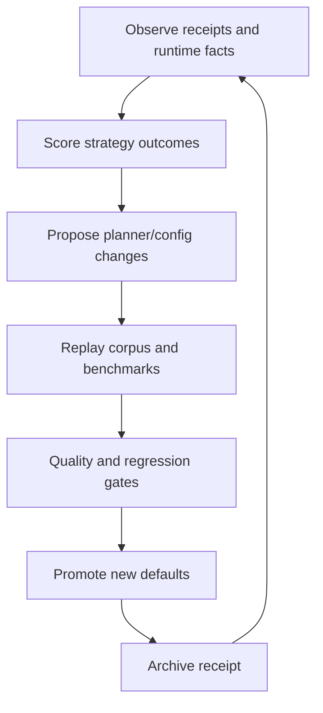

# Learning Loop Specification

Deep-Diff-Forge improves through measured review outcomes, not vague preference.

## Purpose

The learning loop tunes:

- planner strategy selection
- semantic fallback thresholds
- review graph ranking
- generated/vendor detection
- annotation grounding quality
- UI default toggles
- cache policy

It never mutates patch truth.

## Evidence Sources

| Source | Signal |
| --- | --- |
| Corpus regression | Output drift, parser failures, ranking drift. |
| Benchmarks | Latency, memory, cache hit rate, graph expansion cost. |
| User review decisions | Approved, rejected, skipped, revisited hunks. |
| Agent annotations | Grounded, ungrounded, contradicted, accepted. |
| CI gates | Check, clippy, tests, packaging, smoke. |
| Runtime telemetry | Fallback reasons, daemon health, socket errors. |
| Release receipts | Before/after comparison across versions. |

## Loop Topology



## Learning Units

### Planner Learning

Input:

- file size
- language
- parser version
- syntax node count
- diff size
- generated/vendor classification
- previous fallback reason
- semantic usefulness score

Output:

- preferred strategy
- budget profile
- fallback threshold
- cache priority

### Ranking Learning

Input:

- hunk reviewed first
- hunk revisited
- hunk approved without changes
- hunk caused fix
- hunk correlated with test failure
- public API touch
- ownership and dependency fan-out

Output:

- risk ranking weights
- review stream order
- "needs human first" label

### Annotation Learning

Input:

- evidence span count
- claim accepted/rejected
- contradiction with tests or source
- reviewer override

Output:

- annotation trust tier
- agent source quality score
- display prominence

## Scoring Model

Every strategy decision gets a receipt:

```text
file: src/example.rs
strategy: Syntax
fallback: none
elapsed_ms: 12
bytes: 18420
nodes: 2840
cache: hit
review_outcome: accepted
user_revisited: false
```

A strategy earns trust when it is:

- fast enough
- stable across reruns
- helpful to reviewers
- not hiding patch truth
- not producing misleading semantic spans

## Promotion Rules

No learned default is promoted unless:

- corpus regression is unchanged or intentionally updated
- benchmark regression is within budget
- fallback rate does not worsen materially
- ranking improvement is supported by receipts
- a human can inspect the change

## Storage

Local learning data:

```text
$XDG_STATE_HOME/deep-diff-forge/learning/
  receipts/
  planner/
  ranking/
  annotations/
```

Repository learning fixtures:

```text
fixtures/
  corpus/
  expected/
  regressions/
benchmarks/
reports/
```

The 10TB disk can store large historical corpora and benchmark archives, but repo-local fixtures must remain small enough for normal clone and CI.

## Privacy And Safety

- Do not upload source snippets by default.
- Prefer hashes, counts, timings, and local-only receipts.
- Redact paths outside the repo unless user opts in.
- Agent annotations are untrusted until grounded.
- Learned behavior must be explainable through receipts.

## Deployment Link

- Framework: [Codebase Deployment Framework](DEPLOYMENT_FRAMEWORK.md)
