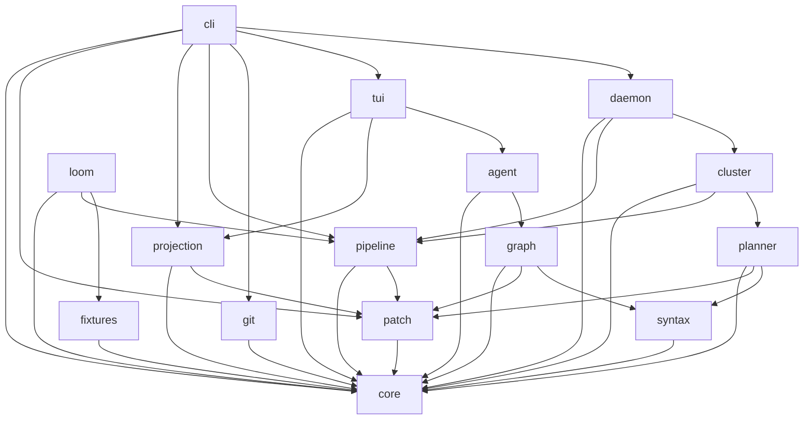
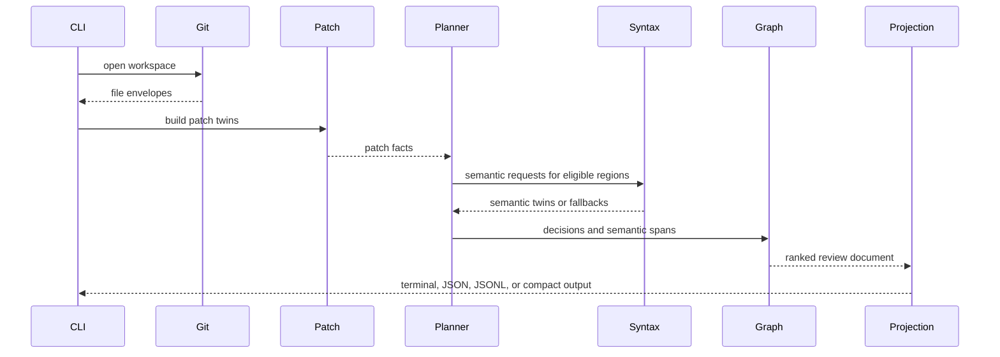
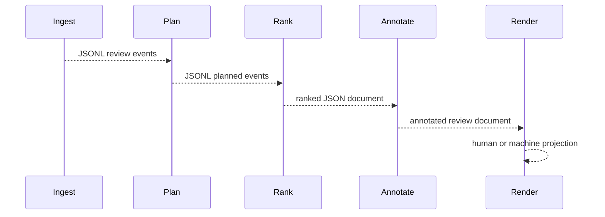
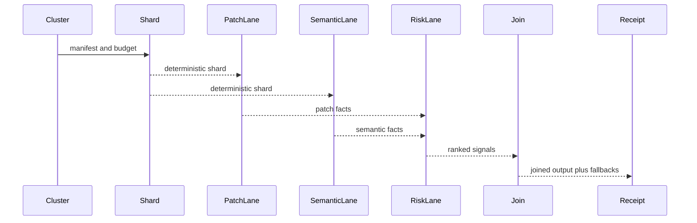
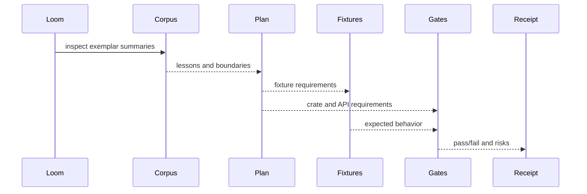

# Module Structure Plan

Deep-Diff-Forge will be a Rust workspace with narrow crates, small modules, and
one-way dependency flow. The design draws from the local exemplar corpus:

- Difftastic separates parsing, diff algorithms, display, files, options, and
  exit codes. Keep that algorithmic clarity.
- Hunk separates core loading, patch handling, VCS adapters, session protocol,
  UI rendering, and benchmarks. Keep that product and session clarity.
- The agent exemplar uses explicit phases, artifacts, and receipts. Keep that
  controlled assimilation flow for loom-driven development.

The result should not be one large engine crate. It should be a set of Rust
crates that can be tested, benchmarked, fuzzed, and released with stable
contracts.

## Design Rules

1. **Core is vocabulary, not behavior.**
   `deep-diff-forge-core` owns stable IDs, enums, model structs, receipts, and
   shared value types. It should not parse Git, open sockets, render ANSI, or
   run tree-sitter.

2. **Patch truth is upstream of every other feature.**
   Patch parsing and patch rendering must be usable without syntax analysis,
   agent annotations, TUI, daemon, or cluster execution.

3. **Each crate owns one reason to change.**
   Parser upgrades, TUI changes, Git support, agent protocol, and daemon IPC
   should not land in the same crate.

4. **Dependency flow is inward and acyclic.**
   Feature crates may depend on `core`; `core` depends on no feature crate.
   Projection can depend on patch and graph; patch must not depend on TUI.

5. **Public APIs are explicit.**
   Each crate exposes a small `lib.rs` facade. Internal modules stay `pub(crate)`
   unless another crate genuinely needs them.

6. **Rust first, CLI first, daemon optional.**
   All behavior must work in one-shot CLI mode. The daemon accelerates shared
   cache and multi-client workflows but does not own correctness.

7. **Receipts are first-class outputs.**
   Cluster, loom, corpus, benchmark, and release operations produce structured
   receipts with versions, inputs, budgets, and results.

## Workspace Layout

```text
deep-diff-forge/
  Cargo.toml
  crates/
    deep-diff-forge-core/
    deep-diff-forge-cli/
    deep-diff-forge-patch/
    deep-diff-forge-projection/
    deep-diff-forge-pipeline/
    deep-diff-forge-git/
    deep-diff-forge-syntax/
    deep-diff-forge-planner/
    deep-diff-forge-graph/
    deep-diff-forge-agent/
    deep-diff-forge-tui/
    deep-diff-forge-cluster/
    deep-diff-forge-loom/
    deep-diff-forge-daemon/
    deep-diff-forge-fixtures/
  fixtures/
    patch/
    syntax/
    projection/
    graph/
    agent/
    loom/
  benches/
    patch_parse.rs
    syntax_match.rs
    projection_render.rs
    cluster_join.rs
  fuzz/
    fuzz_targets/
      patch_parser.rs
      jsonl_stream.rs
      syntax_lowering.rs
  docs/
```

## Dependency Graph



Forbidden dependencies:

- `core` must not depend on any other Deep-Diff-Forge crate.
- `patch` must not depend on `syntax`, `graph`, `agent`, `tui`, `daemon`, or
  `cluster`.
- `syntax` must not depend on `projection`, `tui`, `daemon`, or `agent`.
- `projection` must not depend on `tui`; TUI consumes projections.
- `daemon` must not be required by CLI one-shot commands.
- `loom` must not mutate implementation crates without explicit output paths,
  gates, and receipts.

## Crate Charters

### `deep-diff-forge-core`

Stable model crate. This crate should compile quickly and have minimal
dependencies.

```text
src/
  lib.rs
  ids.rs
  ranges.rs
  file.rs
  patch_model.rs
  semantic_model.rs
  planner_model.rs
  graph_model.rs
  annotation_model.rs
  execution_model.rs
  loom_model.rs
  receipts.rs
  errors.rs
```

Responsibilities:

- IDs: file, hunk, line, span, annotation, session, lane, receipt.
- Ranges: byte ranges, line ranges, side-specific ranges.
- Patch model: patch twin structs, hunk structs, metadata.
- Semantic model: parse status, semantic spans, semantic change kinds.
- Planner model: strategies, budgets, fallback reasons.
- Graph model: node IDs, edge kinds, risk signals.
- Annotation model: provenance, grounding, evidence links.
- Execution model: dimensions, lanes, stream contracts, join policies.
- Loom model: phases, plan descriptors, assimilation records.
- Receipts: shared receipt headers and result status.

Public API rule:

- `lib.rs` re-exports stable types.
- Internal helpers remain private.
- No filesystem, network, terminal, parser, or Git operations.

### `deep-diff-forge-patch`

Canonical patch parser and renderer.

```text
src/
  lib.rs
  parser/
    mod.rs
    git_header.rs
    unified.rs
    hunk_header.rs
    line.rs
    binary.rs
    errors.rs
  normalize/
    mod.rs
    paths.rs
    modes.rs
    newline.rs
  render/
    mod.rs
    unified.rs
    git_format.rs
  rows/
    mod.rs
    side_by_side.rs
    inline.rs
    anchors.rs
  stats.rs
  validate.rs
```

Responsibilities:

- Parse unified and Git-format patches.
- Preserve file modes, renames, copies, binary markers, no-newline markers.
- Normalize path and newline metadata without losing raw provenance.
- Render apply-able patches from `PatchTwin`.
- Build patch row anchors for projection.
- Return typed parse errors and partial fallback records.

Contextual flow:

```text
bytes -> parser -> raw patch events -> normalize -> PatchTwin -> validate -> render/projection
```

Gold-standard tests:

- Round-trip parser/render fixtures.
- Bad hunk header fixtures.
- Rename/copy/mode fixtures.
- Binary file fixtures.
- No-newline fixtures.
- Fuzz target for parser.

### `deep-diff-forge-projection`

Renderer-neutral output planning. This crate creates rows and view models, not
terminal UI widgets.

```text
src/
  lib.rs
  model.rs
  inline.rs
  side_by_side.rs
  stacked.rs
  compact.rs
  json.rs
  jsonl.rs
  ansi.rs
  context.rs
  width.rs
  window.rs
  style.rs
```

Responsibilities:

- Convert `ReviewDocument` into inline, side-by-side, stacked, JSON, JSONL,
  compact, and ANSI-ready view models.
- Apply runtime toggles without mutating patch or semantic truth.
- Compute responsive layout decisions from terminal width and config.
- Window large review streams by file/hunk/row.
- Keep display rows stable for TUI, pager, and snapshot tests.

Contextual flow:

```text
ReviewDocument + ProjectionOptions -> ProjectionPlan -> rows/events -> renderer
```

### `deep-diff-forge-pipeline`

Composable Unix-filter execution.

```text
src/
  lib.rs
  stage.rs
  manifest.rs
  runner.rs
  stream/
    mod.rs
    json.rs
    jsonl.rs
    compact.rs
    human.rs
  stages/
    ingest.rs
    plan.rs
    rank.rs
    annotate.rs
    render.rs
  receipts.rs
  errors.rs
```

Responsibilities:

- Define `ChainStage`, `StageInput`, `StageSink`, and `StageResult`.
- Run one stage or a manifest-defined chain.
- Preserve stdout/stderr separation.
- Stream JSONL progressively.
- Enforce explicit stdin modes.
- Emit pipeline receipts.

Contextual flow:

```text
input source -> ingest -> plan -> rank -> annotate -> render -> stdout
```

### `deep-diff-forge-git`

Git and VCS input adapter. Start with Git through `gix`; keep other VCS support
behind traits.

```text
src/
  lib.rs
  workspace.rs
  status.rs
  tree.rs
  index.rs
  worktree.rs
  external_diff.rs
  attributes.rs
  ignore.rs
  source.rs
  errors.rs
```

Responsibilities:

- Discover repository root and worktree state.
- Read file pairs from index, worktree, commits, and external diff invocation.
- Respect `.gitattributes` and ignore rules.
- Produce input envelopes for `patch` and `planner`.
- Avoid mutating Git state.

Contextual flow:

```text
repo root -> status/tree/index/worktree -> file envelopes -> patch/planner
```

### `deep-diff-forge-syntax`

Syntax parsing, lowering, and structural matching.

```text
src/
  lib.rs
  language/
    mod.rs
    detect.rs
    registry.rs
    config.rs
  parse/
    mod.rs
    tree_sitter.rs
    budget.rs
    errors.rs
  lower/
    mod.rs
    node.rs
    text.rs
    fingerprint.rs
  matchers/
    mod.rs
    lcs.rs
    moved.rs
    renamed.rs
    reformat.rs
  highlight/
    mod.rs
    queries.rs
    spans.rs
```

Responsibilities:

- Detect language from path, content, and config.
- Parse with tree-sitter under byte, node, and time budgets.
- Lower parser-specific trees to engine-neutral syntax nodes.
- Match semantic spans to patch hunks.
- Detect moved nodes, symbol renames, and reformat-only changes.
- Report explicit fallback reasons.

Contextual flow:

```text
file text + language -> parse -> lower -> fingerprint -> match -> SemanticTwin
```

### `deep-diff-forge-planner`

Adaptive strategy selection.

```text
src/
  lib.rs
  planner.rs
  budgets.rs
  eligibility.rs
  generated.rs
  binary.rs
  regions.rs
  fallbacks.rs
  explain.rs
```

Responsibilities:

- Choose line, word, syntax, moved-block, binary, or suppression strategy.
- Split large files into region plans.
- Apply budget profiles: fast, balanced, deep, corpus.
- Explain every strategy and fallback.
- Preserve patch truth when semantic work is skipped.

Contextual flow:

```text
file envelope + patch facts + config -> region plans -> patch/syntax requests -> PlannerDecision
```

### `deep-diff-forge-graph`

Review Intelligence Graph.

```text
src/
  lib.rs
  graph.rs
  nodes.rs
  edges.rs
  builder.rs
  rank.rs
  risk.rs
  ownership.rs
  tests.rs
  history.rs
  explain.rs
```

Responsibilities:

- Connect files, hunks, symbols, tests, owners, risks, commands, and annotations.
- Rank review order deterministically.
- Explain why a file or hunk is high priority.
- Integrate history and coverage signals when available.

Contextual flow:

```text
PatchTwin + SemanticTwin + history + annotations -> graph -> ranked ReviewDocument
```

### `deep-diff-forge-agent`

Agent annotation and evidence protocol.

```text
src/
  lib.rs
  protocol.rs
  annotation.rs
  grounding.rs
  evidence.rs
  approvals.rs
  review_request.rs
  sanitise.rs
```

Responsibilities:

- Add, list, resolve, and export annotations.
- Separate human, agent-grounded, agent-ungrounded, and system-generated notes.
- Attach command evidence and source anchors.
- Sanitize untrusted annotation input.
- Provide Claude Code friendly request/response types.

### `deep-diff-forge-tui`

Interactive terminal UI.

```text
src/
  lib.rs
  app.rs
  event.rs
  state.rs
  layout/
    mod.rs
    responsive.rs
    panes.rs
    sidebar.rs
  widgets/
    review_stream.rs
    file_nav.rs
    hunk.rs
    annotation.rs
    status.rs
  input/
    keyboard.rs
    mouse.rs
    commands.rs
  theme/
    mod.rs
    syntax.rs
  terminal.rs
```

Responsibilities:

- Review-first interactive stream.
- Multi-file sidebar and navigation state.
- Mouse support.
- Runtime toggles.
- Responsive split/stack layout.
- Consume projection plans, not raw parser internals.

### `deep-diff-forge-cluster`

Parallel dimensional execution.

```text
src/
  lib.rs
  scheduler.rs
  shard.rs
  lane.rs
  dimensions.rs
  join.rs
  budgets.rs
  receipts.rs
  replay.rs
```

Responsibilities:

- Shard files and corpus manifests deterministically.
- Run patch, semantic, risk, agent, storage, history, and presentation lanes.
- Bound local parallelism.
- Join outputs by deterministic input order, ranked review order, or as-ready
  stable IDs.
- Emit receipts and replay manifests.

### `deep-diff-forge-loom`

Controlled assimilation and integration system.

```text
src/
  lib.rs
  plan.rs
  intake.rs
  boundary.rs
  weave.rs
  fixtures.rs
  gates.rs
  receipt.rs
  crate_stub.rs
  corpus.rs
```

Responsibilities:

- Read exemplar source summaries and feature requests.
- Produce adopt/adapt/reject/defer decisions.
- Map feature work to crate ownership and API changes.
- Generate fixture manifests and crate stub plans.
- Run gates through pipeline and cluster crates.
- Emit assimilation receipts.

### `deep-diff-forge-daemon`

Optional IPC and cache daemon.

```text
src/
  lib.rs
  main.rs
  rpc.rs
  transport/
    mod.rs
    uds.rs
    named_pipe.rs
  session.rs
  subscriptions.rs
  cache.rs
  security.rs
  lifecycle.rs
  errors.rs
```

Responsibilities:

- Serve JSON-RPC over user-private Unix sockets or Windows named pipes.
- Maintain review sessions and cache handles.
- Provide progress subscriptions.
- Enforce socket ownership and payload limits.
- Never be required for one-shot CLI correctness.

### `deep-diff-forge-cli`

Thin command entry point.

```text
src/
  main.rs
  args.rs
  commands/
    mod.rs
    diff.rs
    review.rs
    ingest.rs
    plan.rs
    rank.rs
    annotate.rs
    render.rs
    chain.rs
    cluster.rs
    loom.rs
    daemon.rs
    doctor.rs
    contracts.rs
  output.rs
  exit.rs
```

Responsibilities:

- Parse arguments.
- Dispatch to library crates.
- Map errors to stable exit codes.
- Maintain stdout/stderr contracts.
- Avoid embedding engine logic in command handlers.

## Contextual Code Flow

### One-Shot Git Review



### Chainable Bash Flow



### Clustered Corpus Flow



### Loom Assimilation Flow



## Public API Conventions

Each crate should follow this pattern:

```rust
pub use crate::error::{Error, Result};
pub use crate::model::{Input, Output};

mod error;
mod internal_module;
pub mod model;
```

Rules:

- Public modules contain stable contract types.
- Internal implementation modules are private or `pub(crate)`.
- Constructors validate invariants where cheap.
- Expensive validation is explicit through `validate()` methods.
- API structs use owned data at public boundaries unless borrowing is essential.
- Streaming APIs use sinks/iterators to avoid unbounded buffers.

## Error And Result Conventions

Each feature crate owns its local error type and converts into a shared engine
error only at integration boundaries.

```rust
pub type Result<T> = std::result::Result<T, Error>;

#[derive(Debug)]
pub enum Error {
    InvalidInput(String),
    BudgetExceeded(BudgetKind),
    Unsupported(UnsupportedReason),
    Io(std::io::Error),
}
```

Error rules:

- Do not use `anyhow` in public library APIs.
- Do not panic for malformed user input.
- Convert recoverable semantic failures into fallback records.
- Convert contract violations into stable CLI exit codes.
- Include enough context for Claude Code to act without scraping prose.

## Test Placement

```text
crates/<crate>/src/*          unit tests close to logic
crates/<crate>/tests/*        crate integration tests
fixtures/<domain>/*           reusable behavior fixtures
benches/*                     performance benchmarks
fuzz/fuzz_targets/*           parser and codec fuzz targets
```

Minimum test bar by crate:

| Crate | Required tests |
| --- | --- |
| `core` | ID equality, range invariants, receipt serialization. |
| `patch` | Parser fixtures, render round-trip, fuzz target. |
| `projection` | Snapshot rows, width behavior, JSON/JSONL schemas. |
| `pipeline` | stdout/stderr split, pipe behavior, manifest execution. |
| `git` | repo fixtures, external diff invocation shapes. |
| `syntax` | parser fallback, moved node, rename, reformat fixtures. |
| `planner` | strategy matrix, budget exhaustion, generated-file suppression. |
| `graph` | ranking determinism, risk reasons, ownership/test links. |
| `agent` | grounded vs ungrounded annotations, evidence validation. |
| `tui` | layout state, keyboard/mouse commands, smoke snapshots. |
| `cluster` | deterministic sharding, join policies, receipt replay. |
| `loom` | plan parser, boundary decisions, gate receipts. |
| `daemon` | socket lifecycle, version negotiation, session subscription. |

## Feature Flags

Feature flags should trim heavy surfaces without changing core models.

```toml
[features]
default = ["cli", "patch", "projection"]
cli = []
git = ["dep:gix"]
syntax = ["dep:tree-sitter"]
tui = ["dep:ratatui", "dep:crossterm"]
daemon = ["dep:tokio"]
cluster = ["dep:rayon"]
loom = []
vendored-parsers = ["syntax"]
```

Rules:

- `core` has no default heavy features.
- `patch` and `projection` should stay lightweight.
- `syntax` owns tree-sitter parser weight.
- `daemon` owns async runtime weight.
- `cluster` owns local parallel scheduler weight.

## Implementation Order

### Milestone 1: Patch Spine

- Split current core model into modules.
- Add `deep-diff-forge-patch`.
- Parse and render unified patches.
- Add `--stdin-patch --json`.
- Add patch fixtures and parser fuzz target.

### Milestone 2: Projection Spine

- Add `deep-diff-forge-projection`.
- Build inline, side-by-side, stacked, JSON, and JSONL projections.
- Add width-aware layout tests.
- Add pager-compatible human output.

### Milestone 3: Pipeline Spine

- Add `deep-diff-forge-pipeline`.
- Implement ingest, plan, rank, and render stage traits.
- Add chain manifests and contract tests.
- Preserve strict Bash behavior under `set -euo pipefail`.

### Milestone 4: Git And Planner

- Add `deep-diff-forge-git`.
- Add `deep-diff-forge-planner`.
- Support Git worktree, file pair, directory pair, and external diff inputs.
- Add budget profiles and explanation output.

### Milestone 5: Syntax And Graph

- Add `deep-diff-forge-syntax`.
- Add `deep-diff-forge-graph`.
- Implement syntax fallback, moved-block detection, risk ranking, and graph
  explanations.

### Milestone 6: Agent And TUI

- Add `deep-diff-forge-agent`.
- Add `deep-diff-forge-tui`.
- Implement review stream, sidebar, mouse navigation, runtime toggles, and
  grounded agent annotations.

### Milestone 7: Cluster And Loom

- Add `deep-diff-forge-cluster`.
- Add `deep-diff-forge-loom`.
- Run deterministic local parallel lanes.
- Generate loom plans, fixtures, gates, and receipts.

### Milestone 8: Daemon And Release

- Add `deep-diff-forge-daemon`.
- Implement user-private UDS/named-pipe lifecycle.
- Add shared cache and session subscriptions.
- Add release packaging and deployment receipts.

## Review Checklist For Every New Module

- Does this module have one reason to change?
- Is its public API smaller than its private implementation?
- Does it preserve patch truth?
- Does it avoid daemon dependence?
- Does it stream large data?
- Does it expose stable IDs?
- Does it have fixtures or tests matching its risk?
- Does it emit structured errors or fallback records?
- Does it fit the dependency graph?
- Does it have a receipt path if it affects corpus, cluster, loom, or release?

