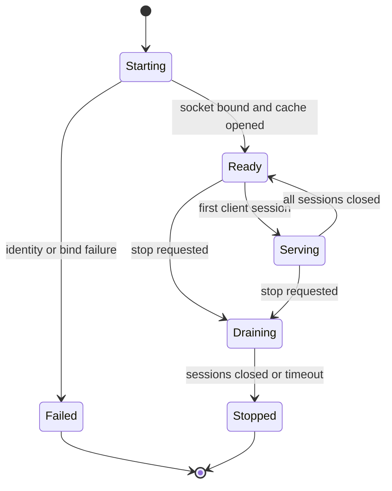

# Operations And Daemon Specification

The daemon is optional. Deep-Diff-Forge must remain useful as a CLI and library without it.

The daemon exists for top-tail latency and coordination:

- shared AST cache
- shared line-index cache
- multi-client review sessions
- agent annotation subscriptions
- long-running corpus indexing

## Service Identity

| Field | Value |
| --- | --- |
| Service id | `deep-diff-forge` |
| Binary | `deep-diff-forge` |
| Daemon subcommand | `deep-diff-forge daemon` |
| Default transport | Unix domain socket |
| TCP default | Disabled |
| Health method | `daemon.health` |
| Status method | `daemon.status` |

## Socket Locations

| Platform | Path |
| --- | --- |
| Linux | `$XDG_RUNTIME_DIR/deep-diff-forge/deep-diff-forge.sock` |
| Linux fallback | `/tmp/deep-diff-forge-$UID/deep-diff-forge.sock` |
| macOS | `$TMPDIR/deep-diff-forge-$UID/deep-diff-forge.sock` |
| Windows | `\\.\pipe\deep-diff-forge-$USER` |

## Daemon State Machine



## Startup Gates

The daemon refuses startup unless:

- runtime directory exists or can be created
- runtime directory is owned by the current user
- runtime directory mode is `0700` on Unix
- socket path is not an active daemon owned by another process
- cache directory is writable
- protocol version is supported

## Health RPC

Request:

```json
{"jsonrpc":"2.0","id":1,"method":"daemon.health","params":{}}
```

Response:

```json
{
  "jsonrpc": "2.0",
  "id": 1,
  "result": {
    "status": "ok",
    "version": "0.1.0",
    "pid": 12345,
    "socket": "/run/user/1000/deep-diff-forge/deep-diff-forge.sock",
    "sessions": 0,
    "cache_entries": 0
  }
}
```

## Status RPC

Status reports must include:

- protocol versions
- uptime
- active sessions
- cache generations
- cache hit/miss counters
- fallback counters by reason
- last recoverable error
- feature flags

## systemd User Unit

Future Linux user service:

```ini
[Unit]
Description=Deep-Diff-Forge local review daemon
After=default.target

[Service]
Type=simple
ExecStart=%h/.local/bin/deep-diff-forge daemon start --foreground
ExecStop=%h/.local/bin/deep-diff-forge daemon stop
Restart=on-failure
RestartSec=2
NoNewPrivileges=true
PrivateTmp=true
ProtectSystem=strict
ProtectHome=read-only
ReadWritePaths=%h/.cache/deep-diff-forge %h/.local/state/deep-diff-forge %t/deep-diff-forge

[Install]
WantedBy=default.target
```

## Operational Commands

```bash
deep-diff-forge daemon start
deep-diff-forge daemon start --foreground
deep-diff-forge daemon status
deep-diff-forge daemon health
deep-diff-forge daemon stop
deep-diff-forge cache status
deep-diff-forge cache prune --older-than 30d
deep-diff-forge cache prune --max-size 20GiB
```

## Failure Handling

| Failure | Required behavior |
| --- | --- |
| Stale socket | Probe, remove only if dead and owned by current user. |
| Cache decode failure | Ignore entry, record fallback, continue. |
| Parser panic | Catch at worker boundary, mark semantic fallback. |
| Oversized payload | Reject with structured error. |
| Client disconnect | Cancel session subscription, keep shared cache. |
| Out of budget | Preserve patch twin and record semantic fallback. |

## Observability

Log levels:

- `error`: data loss, daemon crash, failed startup
- `warn`: fallback, cache corruption, rejected socket
- `info`: session open/close, cache generation, release version
- `debug`: planner decisions
- `trace`: parser details

Metrics:

- `ddf_sessions_open`
- `ddf_files_planned_total`
- `ddf_semantic_fallback_total{reason}`
- `ddf_cache_hit_total{kind}`
- `ddf_cache_miss_total{kind}`
- `ddf_projection_latency_ms{mode}`
- `ddf_review_rank_latency_ms`

## Habitat Deployment Cut

If adopted as a local service citizen, Deep-Diff-Forge should be UDS-only at first.

Service row:

| Service | ID | Port | Health | Notes |
| --- | --- | --- | --- | --- |
| Deep-Diff-Forge | `deep-diff-forge` | UDS | `daemon.health` | Review daemon, AST cache, agent annotations, no TCP by default. |

