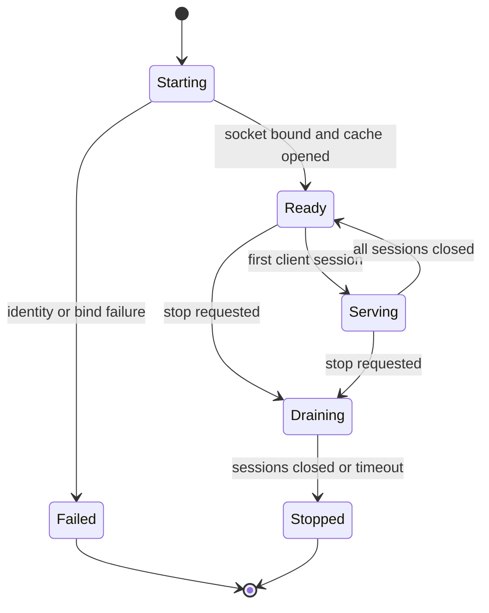

# Operations And Daemon Specification

The daemon is optional. Deep-Diff-Forge must remain useful as a CLI and library without it.

This document includes planned operational surface area. The implemented
security boundary is authoritative in [`SECURITY.md`](../SECURITY.md); items
described as future or planned are not current guarantees.

The daemon exists for top-tail latency and coordination:

- shared AST cache
- shared line-index cache
- multi-client review sessions
- agent annotation subscriptions
- long-running corpus indexing

## Service Identity

| Field | Value |
| --- | --- |
| Service id | `deep-diff-forge` |
| Binary | `deep-diff-forge` |
| Daemon subcommand | `deep-diff-forge daemon` |
| Default transport | Unix domain socket |
| TCP transport | Not implemented |
| Health method | `daemon.health` |
| Status method | `daemon.status` |

## Socket Locations

| Platform | Path or status |
| --- | --- |
| Unix with `$XDG_RUNTIME_DIR` | `$XDG_RUNTIME_DIR/deep-diff-forge/deep-diff-forge.sock` |
| Unix without `$XDG_RUNTIME_DIR` | Fails closed — pass `--socket PATH`; there is no `/tmp` fallback |
| Windows | Daemon unsupported; no named-pipe implementation |

## Daemon State Machine


```mermaid
stateDiagram-v2
    [*] --> Starting
    Starting --> Ready: socket bound and cache opened
    Starting --> Failed: identity or bind failure
    Ready --> Serving: first client session
    Serving --> Ready: all sessions closed
    Ready --> Draining: stop requested
    Serving --> Draining: stop requested
    Draining --> Stopped: sessions closed or timeout
    Failed --> [*]
    Stopped --> [*]
```

## Startup Gates

The implemented daemon refuses startup unless:

- a secure runtime base is available or an explicit socket path is supplied;
- the socket parent exists as, or can be created as, an effective-user-owned
  non-symlink directory with mode `0700`;
- an existing socket path is either absent or verifiably a socket rather than a
  symlink, regular file, or directory; and
- the newly bound socket can be restricted to mode `0600`.

Socket type and filesystem identity are checked, but liveness of an existing
same-user socket is not probed before replacement. Operators must serialize
starts and must not run multiple daemon instances at the same path.

## Health RPC

Request:

```json
{"jsonrpc":"2.0","id":1,"method":"daemon.health","params":{}}
```

Response:

```json
{
  "jsonrpc": "2.0",
  "id": 1,
  "result": {
    "status": "ok",
    "version": "0.2.1",
    "pid": 12345,
    "sessions": 0,
    "retained_bytes": 0,
    "cache_entries": 0,
    "protocol": 0
  }
}
```

## Status RPC

Status reports must include:

- protocol versions
- uptime
- active sessions
- cache generations
- cache hit/miss counters
- fallback counters by reason
- last recoverable error
- feature flags

## systemd User Unit

Future Linux user service:

```ini
[Unit]
Description=Deep-Diff-Forge local review daemon
After=default.target

[Service]
Type=simple
ExecStart=%h/.local/bin/deep-diff-forge daemon start --foreground
ExecStop=%h/.local/bin/deep-diff-forge daemon stop
Restart=on-failure
RestartSec=2
NoNewPrivileges=true
PrivateTmp=true
ProtectSystem=strict
ProtectHome=read-only
ReadWritePaths=%h/.cache/deep-diff-forge %h/.local/state/deep-diff-forge %t/deep-diff-forge

[Install]
WantedBy=default.target
```

## Operational Commands

```bash
deep-diff-forge daemon start
deep-diff-forge daemon start --foreground
deep-diff-forge daemon status
deep-diff-forge daemon health
deep-diff-forge daemon stop
deep-diff-forge cache status
deep-diff-forge cache prune --older-than 30d
deep-diff-forge cache prune --max-size 20GiB
```

## Failure Handling

| Failure | Required behavior |
| --- | --- |
| Existing socket | In an owner-private parent, remove only when the path itself is a socket; serialize starts because liveness is not probed. |
| Cache decode failure | Ignore entry, record fallback, continue. |
| Parser panic | Catch at worker boundary, mark semantic fallback. |
| Oversized payload | Reject with structured error. |
| Client disconnect | Cancel session subscription, keep shared cache. |
| Out of budget | Preserve patch twin and record semantic fallback. |

## Observability

Log levels:

- `error`: data loss, daemon crash, failed startup
- `warn`: fallback, cache corruption, rejected socket
- `info`: session open/close, cache generation, release version
- `debug`: planner decisions
- `trace`: parser details

Metrics:

- `ddf_sessions_open`
- `ddf_files_planned_total`
- `ddf_semantic_fallback_total{reason}`
- `ddf_cache_hit_total{kind}`
- `ddf_cache_miss_total{kind}`
- `ddf_projection_latency_ms{mode}`
- `ddf_review_rank_latency_ms`

## Habitat Deployment Cut

If adopted as a local service citizen, Deep-Diff-Forge should be UDS-only at first.

Service row:

| Service | ID | Port | Health | Notes |
| --- | --- | --- | --- | --- |
| Deep-Diff-Forge | `deep-diff-forge` | UDS | `daemon.health` | Review daemon, AST cache, agent annotations, no TCP by default. |

## Deployment Link

- Framework: [Codebase Deployment Framework](DEPLOYMENT_FRAMEWORK.md)
