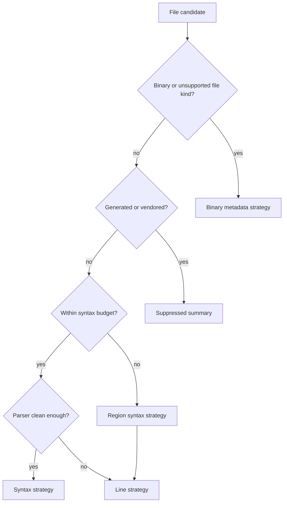

# Performance And Novelty Design

This document records the top-tail design choices that make Deep-Diff-Forge more than a composite of existing tools.

## Performance Target

Deep-Diff-Forge should feel immediate on ordinary changes and remain controlled on pathological changes.

| Case | Target behavior |
| --- | --- |
| Small file pair | Complete patch and semantic diff in one synchronous pass. |
| Medium repo diff | Show patch-first review stream quickly, fill semantic spans progressively. |
| Large generated file | Detect, suppress or summarize, never freeze the review. |
| Parser failure | Fall back to text diff with explicit reason. |
| Huge syntax graph | Stop by node/time budget, preserve patch twin, mark semantic fallback. |
| Repeated review | Reuse AST and line-index cache across sessions. |

## Budget Model

Every expensive operation receives a budget.

| Budget | Default intent |
| --- | --- |
| Byte budget | Prevent parsing huge files by accident. |
| Node budget | Prevent syntax graph explosion. |
| Time budget | Preserve interactivity. |
| Memory budget | Prevent cache and graph overgrowth. |
| File count budget | Switch to progressive mode for huge review sets. |

Budgets are part of planner input and fallback output.

## Adaptive Strategy Ladder

## Progressive Rendering

The engine emits usable partial results:

1. File list and status.
2. Patch twins.
3. Side-by-side rows.
4. Syntax highlighting.
5. Semantic spans.
6. Review graph risk ranking.
7. Agent annotations and evidence links.

This lets the UI become useful before the deepest analysis completes.

## Novel Features Beyond Exemplars

### 1. Semantic Patch Twin

The engine maintains synchronized patch and semantic models. This enables:

- patch application and semantic review in one surface
- comments that survive view toggles
- exact line anchors plus syntax-node anchors
- graceful fallback without losing review state

### 2. Review Intelligence Graph

The graph ranks review work by expected value. Signals include:

- public API changes
- control-flow changes
- dependency fan-out
- test touch distance
- generated or vendored code
- ownership hints
- ungrounded AI claims
- previous review decisions

### 3. Adaptive Diff Planner

The planner chooses the cheapest truthful strategy per file and region. It can mix:

- line diff
- word diff
- syntax diff
- moved-block detection
- reformat-only classification
- binary metadata
- generated-file suppression

### 4. Grounded Agent Layer

Agent annotations carry provenance and evidence. The display distinguishes:

- grounded claim
- partially grounded claim
- ungrounded claim
- contradicted claim
- reviewer-approved note

### 5. Shared AST Cache Daemon

The optional daemon caches syntax and line metadata across clients. This is the reason Unix sockets are included. It turns repeated review, IDE integration, and agent workflows into cache hits rather than repeated parses.

## Implementation Techniques

| Technique | Use |
| --- | --- |
| Arena allocation | Fast syntax graph construction and disposal. |
| Content fingerprints | Cache invalidation and duplicate detection. |
| Parallel file planning | Independent per-file strategy selection. |
| Incremental projection | UI updates before all semantic passes finish. |
| Stable IDs | Comments and annotations survive rerenders. |
| Conservative fallback | Never hide changes because a parser failed. |
| Snapshot journals | Reproducible review and agent sessions. |

## Regression Culture

Borrowing from Difftastic, the repo should grow a sample corpus immediately.

Minimum fixture classes:

- pure line edits
- reformat-only changes
- moved function
- renamed symbol
- generated file
- binary file
- malformed syntax
- parser unsupported language
- large file budget fallback
- patch metadata: rename, mode change, deletion, no-newline
- AI annotation with valid evidence
- AI annotation with missing evidence

## Deployment Link

- Framework: [Codebase Deployment Framework](DEPLOYMENT_FRAMEWORK.md)
