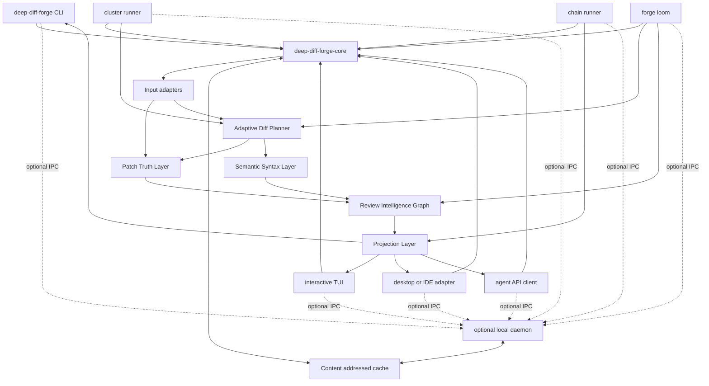
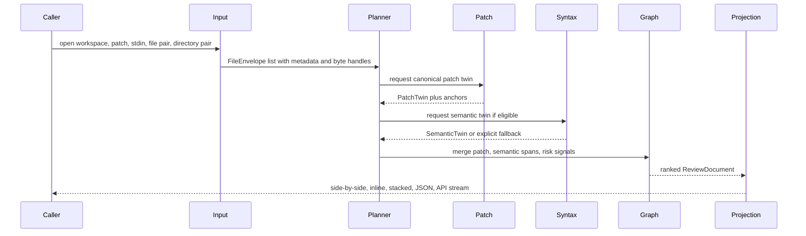
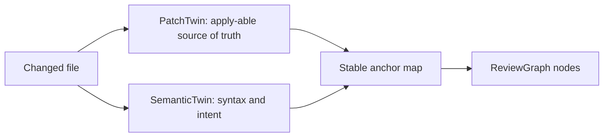
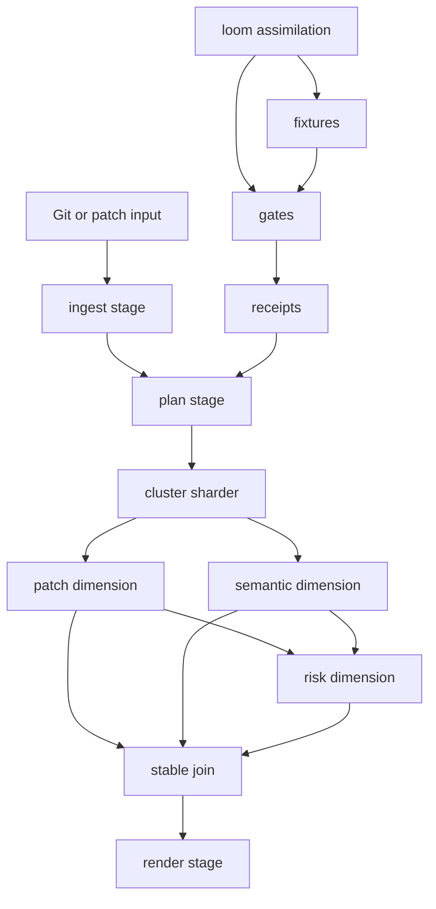
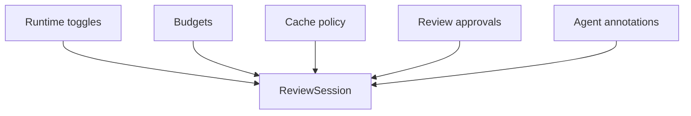
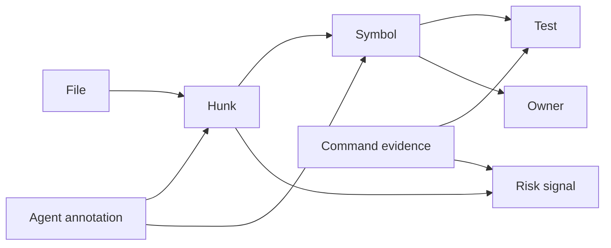

# Architectural Schematics

This document is the implementation map for Deep-Diff-Forge. It turns the product vision into concrete boundaries, APIs, processes, and data flows.

## Exemplar Lessons

Deep-Diff-Forge borrows deliberately, but does not clone.

| Source | Lesson kept | Boundary |
| --- | --- | --- |
| Hunk | Review-first UI, Git/worktree awareness, patch truth, comments, AI approval flow, renderer/controller separation. | Hunk's broad desktop surface is not the core. Deep-Diff-Forge keeps the core renderer-neutral. |
| Difftastic | Syntax-tree diffing, explicit fallbacks, parser budgets, sample-heavy regression culture. | Difftastic output is not patchable, so semantic diffing cannot be canonical patch truth. |
| Delta | Pager adoption, terminal polish, syntax-highlighted readable output. | Pretty rendering is a projection, not the engine model. |
| diff-so-fancy | Human-friendly patch readability. | It is line-patch oriented and not enough for semantic review. |
| classic diff | Patch compatibility, exit-code trust, automation stability. | It lacks semantic and review intelligence. |

## System Topology



## Process Modes

| Mode | Process model | Use case | Default |
| --- | --- | --- | --- |
| Library mode | Caller links `deep-diff-forge-core` and optional crates directly. | Desktop apps, IDEs, tests, embedded tools. | Yes |
| CLI one-shot | `deep-diff-forge` runs once and exits. | Pager, CI, shell workflows. | Yes |
| Chain runner | `deep-diff-forge chain` runs declared stages. | Bash, Claude Code, reproducible pipelines. | Yes after pipeline crate lands |
| Cluster runner | `deep-diff-forge cluster` runs dimensional lanes in parallel. | Large repos, corpora, bounded local parallelism. | Yes after cluster crate lands |
| Interactive TUI | `deep-diff-forge review` owns terminal event loop. | Review stream, mouse navigation, runtime toggles. | Yes after TUI crate lands |
| Loom runner | `deep-diff-forge loom` creates plans, fixtures, gates, and receipts. | Assimilating exemplar lessons and new capabilities. | Yes after loom crate lands |
| Local daemon | `deep-diff-forge daemon` exposes IPC and shared cache. | Multi-client sessions, persistent AST cache, agent coordination. | No, opt-in |

The daemon is not required for correctness. It is a performance and coordination accelerator.

## Core Data Pipeline



## Patch Twin And Semantic Twin



The patch twin is allowed to exist without the semantic twin. The semantic twin is never allowed to replace patch truth.

## Crate Schematic

```text
deep-diff-forge/
  crates/
    deep-diff-forge-core/       Stable model, IDs, planner vocabulary, graph vocabulary.
    deep-diff-forge-cli/        Pager-compatible command surface.
    deep-diff-forge-patch/      Unified patch parser, renderer, side-by-side row builder.
    deep-diff-forge-git/        gix-first Git status, tree, index, worktree, and compare adapters.
    deep-diff-forge-syntax/     Tree-sitter registry, syntax tree lowering, semantic matching.
    deep-diff-forge-planner/    Strategy selection, budgets, fallback records, generated-file detection.
    deep-diff-forge-graph/      Review Intelligence Graph, risk ranking, ownership/test links.
    deep-diff-forge-projection/ Renderer-neutral projections: inline, side-by-side, stacked, JSON.
    deep-diff-forge-pipeline/   Chain stages, stream codecs, manifest runner.
    deep-diff-forge-cluster/    Dimensional sharding, parallel lanes, deterministic joins.
    deep-diff-forge-loom/       Assimilation plans, fixture synthesis, gates, receipts.
    deep-diff-forge-tui/        Terminal UI, mouse support, responsive split/stack review.
    deep-diff-forge-agent/      Agent annotation API, provenance, approval and evidence protocol.
    deep-diff-forge-daemon/     Optional local daemon and IPC server.
```

## API Surface Map

Public APIs are split by stability.

| Stability | Location | Audience |
| --- | --- | --- |
| Stable model API | `crates/deep-diff-forge-core/src/lib.rs` | All crates, plugin authors, API clients. |
| Stable CLI API | `crates/deep-diff-forge-cli/src/main.rs` and command modules | Users, scripts, Git integration. |
| Stable pipeline API | `deep-diff-forge-pipeline` | Bash, Claude Code, CI, reproducible chains. |
| Experimental engine API | `deep-diff-forge-daemon` IPC methods | TUI, desktop adapters, agents. |
| Experimental cluster API | `deep-diff-forge-cluster` | Large repo and corpus runners. |
| Experimental loom API | `deep-diff-forge-loom` | Feature assimilation and receipt generation. |
| Internal strategy API | `deep-diff-forge-planner` | Engine crates only. |
| Internal parser API | `deep-diff-forge-syntax` and `deep-diff-forge-patch` | Engine crates only. |

## Chain, Cluster, And Loom Schematic



The chain path is the default Unix-filter path. The cluster path is the same
work split into deterministic lanes. The loom path feeds the engine with
planned, tested, receipt-backed implementation changes.

## Runtime Control Plane



Runtime toggles are inputs to projection and planning, not mutation of patch truth.

## Review Intelligence Graph



Graph ranking starts with deterministic signals:

- file status and change size
- generated/vendor/test/source classification
- syntax parse status
- control-flow or public API edits
- dependency fan-out
- test ownership and stale coverage hints
- agent claims with or without evidence

## Top-Tail Performance And Novelty Choices

These are the high-leverage choices that push the design beyond central tendency.

| Choice | Why it matters |
| --- | --- |
| Patch/semantic twin model | Keeps patch trust while adding syntax insight. Most tools pick one. |
| Content-addressed AST cache | Reuses parse results across sessions, worktrees, and UI clients. |
| Region-level strategy planning | Avoids whole-file syntax diff cost when only some regions need it. |
| Progressive review graph | UI can show ranked files before every semantic span finishes. |
| Grounded agent annotations | Separates evidence-backed claims from speculative AI text. |
| Budgeted semantic diff | Every parser/graph strategy has byte, node, and time ceilings. |
| Renderer-neutral projections | TUI, desktop, IDE, and JSON share the same core model. |
| Optional daemon only for shared state | Preserves CLI simplicity while enabling elite latency for large repos. |
